<div align="center">

<p align="center">
  
</p>

<h3 align="center">
Universidad Peruana de Ciencias Aplicadas
</h3>

<h3 align="center">
Ingeniería de Software  
<br><br>
Periodo: 202610 
<br><br>
1ASI0657 - Fundamentos Arquitectura de Software
<br><br>
NRC: 7940  
<br><br>
Docente: Mori Yzaguirre, Daniel Enrique  
<br><br>
<strong>Informe de Trabajo Final (TF)</strong>  
<br><br>
Startup: Venti  
<br><br>
Producto: NextHappen  
<br><br>
<br><br>
<strong>Integrantes</strong>  
<br><br>
Cabanillas Meza, Jose Mateo (u202311458)
<br><br>
Nakasone Gomes, Marco Antonio (u202210790)
<br><br>
Carhuancote Domminguez, Gonzalo Alonso (u202210720) 
<br><br>
<br>

**2026**

</h3>
</div>


### Registro de versiones

| Versión | Fecha      | Autor | Descripción de modificación |
| ------- | ---------- | ----- | --------------------------- |
| 1.0     | 15/04/2026 | Todos | Avance 1 TB1                |
| 2.0     | 01/05/2026 | Todos | Avance 2 TB1                |
| 3.0     | 25/05/2026 | Todos | Entrega de Trabajo Parcial (TP) |
| 4.0     | 06/06/2026 | Todos | Entrega de Trabajo Final (TF) - Mejoras Arquitectónicas y DDD |

# ABET – EAC - Student Outcome 7

## Aprendizaje Continuo y Autónomo

**Criterio:** La capacidad de adquirir y aplicar nuevos conocimientos según sea necesario, utilizando estrategias de aprendizaje apropiadas.

En el siguiente cuadro se describe las acciones realizadas y enunciados de conclusiones por parte del equipo, que permiten sustentar el haber alcanzado el logro del ABET – EAC - Student Outcome.

| Criterio específico                                                                                                                         | Acciones realizadas                                                                                                                                                                                                                                                                                                                                                                                                                                                                                                                                                                                                                                                                                                                                                                                                                         | Conclusiones                                                                                                                                                                                                                                                                                                                                                                                                                                                                                                                                                                                                        |
| ------------------------------------------------------------------------------------------------------------------------------------------- | ------------------------------------------------------------------------------------------------------------------------------------------------------------------------------------------------------------------------------------------------------------------------------------------------------------------------------------------------------------------------------------------------------------------------------------------------------------------------------------------------------------------------------------------------------------------------------------------------------------------------------------------------------------------------------------------------------------------------------------------------------------------------------------------------------------------------------------------- | ------------------------------------------------------------------------------------------------------------------------------------------------------------------------------------------------------------------------------------------------------------------------------------------------------------------------------------------------------------------------------------------------------------------------------------------------------------------------------------------------------------------------------------------------------------------------------------------------------------------- |
| **Actualiza conceptos y conocimientos necesarios para su desarrollo profesional y en especial para su proyecto en soluciones de software.** | **Cabanillas Meza, José Mateo** <br><br> **TB1:** Durante el desarrollo del proyecto, actualize mis conocimientos investigando y aplicando metodologías como Lean UX y técnicas de análisis de requerimientos, lo que me permitió mejorar la calidad de mis aportes y adaptarme a las necesidades del sistema. <br><br> **Nakasone Gomes, Marco Antonio** <br><br> **TB1:** Actualicé mis conocimientos incorporando nuevas herramientas y enfoques en el desarrollo de software, lo que me ayudó a contribuir de manera más efectiva en el proyecto y mejorar la toma de decisiones. <br><br> **Carhuancote Domminguez, Gonzalo Alonso** <br><br> **TB1:** Durante el proyecto, reforcé y actualicé mis conocimientos en análisis y diseño de soluciones, aplicando conceptos que permitieron estructurar mejor el desarrollo del sistema. | Demostraros una evolución constante en sus competencias durante el desarrollo del proyecto. A través de la actualización y aplicación de conocimientos en metodologías, herramientas y enfoques de análisis y diseño, lograromos fortalecer la calidad de sus aportes individuales. Esto permitió no solo una mejor estructuración del sistema, sino también una toma de decisiones más acertada y una mayor capacidad de adaptación a los requerimientos del proyecto, evidenciando un trabajo colaborativo orientado a la mejora continua.                                                                        |
| **Reconoce la necesidad del aprendizaje permanente para el desempeño profesional y el desarrollo de proyectos en soluciones de software.**  | **Cabanillas Meza, José Mateo** <br><br> **TB1:** Reconocí la importancia del aprendizaje continuo al identificar mis brechas de conocimiento y buscar información para resolverlas, entendiendo que es clave para mi desarrollo profesional en software. <br><br> **Nakasone Gomes, Marco Antonio** <br><br> **TB1:** Comprendí que el aprendizaje permanente es necesario, por lo que investigué constantemente para fortalecer mis habilidades y adaptarse a los cambios del entorno tecnológico. <br><br> **Carhuancote Domminguez, Gonzalo Alonso** <br><br> **TB1:** Entendí que debo seguir aprendiendo continuamente, por lo que busqué nuevas fuentes de información para mejorar mi desempeño y enfrentar futuros retos profesionales.                                                                                            | Coincidimos en reconocer la importancia del aprendizaje continuo como un pilar fundamental en su formación profesional. A partir de la identificación de nuestras propias brechas de conocimiento, cada uno de nosotros asumió una actitud proactiva al investigar y adquirir nuevas habilidades, lo que nos permitió mejorar nuestro desempeño y adaptarnos a las exigencias del entorno tecnológico. Esta mentalidad de mejora constante no solo fortalece nuestras capacidades actuales, sino que también nos prepara para afrontar con mayor solidez los retos futuros en el ámbito del desarrollo de software. |

# Índice

- [Capítulo I: Introducción](#capítulo-i-introducción)
  - [1.1 Startup Profile](#11-startup-profile)
    - [1.1.1 Descripción de la Startup](#111-descripción-de-la-startup)
    - [1.1.2 Perfiles de integrantes del equipo](#112-perfiles-de-integrantes-del-equipo)
  - [1.2 Solution Profile](#12-solution-profile)
    - [1.2.1 Nombre del producto](#121-nombre-del-producto)
    - [1.2.2 Antecedentes y problemática](#122-antecedentes-y-problemática)
    - [1.2.3 Lean UX Process](#123-lean-ux-process)
      - [1.2.3.1 Lean UX Problem Statement](#1231-lean-ux-problem-statement)
      - [1.2.3.2 Lean UX Assumptions](#1232-lean-ux-assumptions)
      - [1.2.3.3 Lean UX Hypothesis](#1233-lean-ux-hypothesis)
      - [1.2.3.4 Lean UX Canvas](#1234-lean-ux-canvas)
  - [1.3 Segmentos objetivo](#13-segmentos-objetivo)

- [Capítulo II: Requirements & Analysis](#capítulo-ii-requirements--analysis)
  - [2.1 Competidores](#21-competidores)
  - [2.2 Entrevistas](#22-entrevistas)
  - [2.3 Needfinding](#23-needfinding)
    - [2.3.1 User Personas](#231-user-personas)
    - [2.3.2 User Task Matrix](#232-user-task-matrix)
    - [2.3.3 Empathy Maps](#233-empathy-maps)
    - [2.3.4 As-is Scenario Mapping](#234-as-is-scenario-mapping)

- [Capítulo III: Requirements Specification](#capítulo-iii-requirements-specification)
  - [3.1 To-Be Scenario Mapping](#31-to-be-scenario-mapping)
  - [3.2 User Stories](#32-user-stories)
  - [3.3 Impact Map](#33-impact-map)
  - [3.4 Product Backlog](#34-product-backlog)

- [Capítulo IV: Product Architecture Design](#capítulo-iv-product-architecture-design)
  - [4.1 Design Concepts, ViewPoints & ER Diagrams](#41-design-concepts-viewpoints--er-diagrams)
    - [4.1.1 Principles Statements](#411-principles-statements)
    - [4.1.2 Approaches Statements Architectural Styles & Patterns](#412-approaches-statements-architectural-styles--patterns)
    - [4.1.3 Context Diagram](#413-context-diagram)
    - [4.1.4 Approach Driven ViewPoints Diagrams](#414-approach-driven-viewpoints-diagrams)
    - [4.1.5 Relational/Non Relational Database Diagram](#415-relationalnon-relational-database-diagram)
    - [4.1.6 Design Patterns](#416-design-patterns)
    - [4.1.7 Tactics](#417-tactics)

  - [4.2 Architectural Drivers](#42-architectural-drivers)
    - [4.2.1 Design Purpose](#421-design-purpose)
    - [4.2.2 Primary Functionality (Primary User Stories)](#422-primary-functionality-primary-user-stories)
    - [4.2.3 Quality Attribute Scenarios](#423-quality-attribute-scenarios)
    - [4.2.4 Constraints](#424-constraints)
    - [4.2.5 Architectural Concerns](#425-architectural-concerns)

  - [4.3 ADD Iterations](#43-add-iterations)
    - [4.3.X Iteration N: <Iteration Name>](#43x-iteration-n-iteration-name)
      - [4.3.X.1 Architectural Design Backlog N](#43x1-architectural-design-backlog-n)
      - [4.3.X.2 Establish Iteration Goal by Selecting Drivers](#43x2-establish-iteration-goal-by-selecting-drivers)
      - [4.3.X.3 Choose One or More Elements of the System to Refine](#43x3-choose-one-or-more-elements-of-the-system-to-refine)
      - [4.3.X.4 Choose One or More Design Concepts That Satisfy the Selected Drivers](#43x4-choose-one-or-more-design-concepts-that-satisfy-the-selected-drivers)
      - [4.3.X.5 Instantiate Architectural Elements, Allocate Responsibilities, and Define Interfaces](#43x5-instantiate-architectural-elements-allocate-responsibilities-and-define-interfaces)
      - [4.3.X.6 Sketch Views (C4 & UML) and Record Design Decisions](#43x6-sketch-views-c4--uml-and-record-design-decisions)
      - [4.3.X.7 Analysis of Current Design and Review Iteration Goal (Kanban Board)](#43x7-analysis-of-current-design-and-review-iteration-goal-kanban-board)

- [Capítulo V: Product Implementation, Validation & Deployment](#capítulo-v-product-implementation-validation--deployment)
  - [5.1 Testing Suites & General Patterns](#51-testing-suites--general-patterns)
    - [5.1.1 Backend Application Core Testing Suite](#511-backend-application-core-testing-suite)
    - [5.1.2 Pattern Based Backend Application(s)](#512-pattern-based-backend-applications)
    - [5.1.3 Pattern Based Custom Software Library](#513-pattern-based-custom-software-library)
    - [5.1.4 Framework Pattern Driven Refactoring Report](#514-framework-pattern-driven-refactoring-report)

  - [5.2 Software Configuration Management](#52-software-configuration-management)
    - [5.2.1 Software Development Environment Configuration](#521-software-development-environment-configuration)
    - [5.2.2 Source Code Management](#522-source-code-management)
    - [5.2.3 Source Code Style Guide & Conventions](#523-source-code-style-guide--conventions)
    - [5.2.4 Software Deployment Configuration](#524-software-deployment-configuration)

  - [5.3 Microservices Implementation](#53-microservices-implementation)
    - [5.3.1 Sprint 1](#531-sprint-1)
      - [5.3.1.1 Sprint Backlog 1](#5311-sprint-backlog-1)
      - [5.3.1.2 Development Evidence for Sprint Review](#5312-development-evidence-for-sprint-review)
      - [5.3.1.3 Testing Suite Evidence for Sprint Review](#5313-testing-suite-evidence-for-sprint-review)
      - [5.3.1.4 Execution Evidence for Sprint Review](#5314-execution-evidence-for-sprint-review)
      - [5.3.1.5 Microservices Documentation Evidence for Sprint Review](#5315-microservices-documentation-evidence-for-sprint-review)
      - [5.3.1.6 Software Deployment Evidence for Sprint Review](#5316-software-deployment-evidence-for-sprint-review)
      - [5.3.1.7 Team Collaboration Insights during Sprint](#5317-team-collaboration-insights-during-sprint)
      - [5.3.1.8 Kanban Board](#5318-kanban-board)

# Capítulo I: Introducción
## 1.1 Startup Profile

### 1.1.1 Descripción de la Startup

Venti es una startup limeña que nace con el propósito de transformar la manera en la que los ciudadanos descubren y disfrutan experiencias únicas en la ciudad. A través de nuestro producto NextHappen, buscamos convertirnos en el punto de encuentro digital donde los limeños puedan encontrar de forma sencilla y confiable eventos alternativos, ferias independientes y propuestas culturales con poca difusión.

NextHappen se posiciona como una ventana hacia lo diferente: desde ferias emergentes y eventos indie hasta experiencias artísticas que no suelen aparecer en los canales tradicionales. Además, permite acceder a información clara, compra de entradas y recomendaciones personalizadas según los intereses del usuario.

Con un enfoque cercano, humano y auténtico, NextHappen se plantea como un puente entre creadores, emprendedores y el público, facilitando que más personas descubran y conecten con propuestas únicas que enriquecen la vida cultural de la ciudad.

---

### 1.1.2 Perfiles de integrantes del equipo

| Integrante                                                                                           | Descripción de la carrera | Conocimientos y habilidades a apuntar                                                                                                                                                                                                                                                                                                                                                                                                                                                                                                                                         |
| ---------------------------------------------------------------------------------------------------- | ------------------------- | ----------------------------------------------------------------------------------------------------------------------------------------------------------------------------------------------------------------------------------------------------------------------------------------------------------------------------------------------------------------------------------------------------------------------------------------------------------------------------------------------------------------------------------------------------------------------------- |
| Cabanillas Meza, José Mateo <br>            | Ingeniería de Software    | Mi nombre es Mateo Cabanillas y en la actualidad estoy cursando el séptimo ciclo de la carrera de ingeniería de software en la Universidad Peruana de Ciencias Aplicadas, con una mente creativa y una actitud colaborativa. Mi amor por la programación y la resolución de problemas me impulsa a explorar nuevas soluciones y aportar ideas frescas a los proyectos. Como compañero de equipo, soy amable, atento y siempre estoy dispuesto a ayudar. Creo firmemente en la importancia de la comunicación efectiva y la colaboración para lograr resultados excepcionales. |
| Marco Antonio Nakasone Gomes <br>           | Ingeniería de Software    | Tengo 21 años y estoy cursando el 8vo ciclo de la carrera de Ingeniería de Software. Considero que soy bueno trabajando de manera grupal y cumplo con todas las tareas a tiempo. Me gusta aportar con ideas buenas y óptimas para poder mejorar el trabajo.                                                                                                                                                                                                                                                                                                                   |
| Gonzalo Alonso Carhuancote Dominguez <br> | Ingeniería de Software    | Tengo 21 años, estudio la carrera de ingeniería de software en la UPC y trabajo en desarrollo de software. En mis tiempos libres estudio, juego videojuegos y me informo del mundo actual y moderno. Me apasiona la tecnología y manejo lenguajes como C++, Java, Typescript y Python.                                                                                                                                                                                                                                                                                        |

---

## 1.2 Solution Profile

### 1.2.1 Nombre del producto

**NextHappen - Plataforma digital de descubrimiento de eventos alternativos**

---

### 1.2.2 Antecedentes y problemática

En Lima, la oferta de ferias independientes, eventos alternativos y propuestas culturales emergentes ha crecido de forma significativa en los últimos años. Estos espacios no solo impulsan a artistas, colectivos y emprendedores locales, sino que también se han convertido en puntos de encuentro social y cultural para una comunidad que busca experiencias distintas a las tradicionales.

Sin embargo, la forma en que las personas se enteran de estos eventos sigue siendo poco organizada: publicaciones aisladas en redes sociales, historias efímeras, afiches físicos o recomendaciones de boca a boca. Esta fragmentación genera que muchos asistentes potenciales se pierdan de actividades alineadas con sus intereses, mientras que los organizadores enfrentan dificultades para alcanzar a su público objetivo y dar visibilidad a sus propuestas.

A este contexto se suma la falta de herramientas tecnológicas que centralicen la información y permitan tanto a los usuarios como a los organizadores contar con datos actualizados en tiempo real. Problemas como cambios de horarios no comunicados, ubicaciones poco claras o falta de información confiable reducen la experiencia del público y limitan el crecimiento del ecosistema cultural independiente.

En este escenario, surge la necesidad de una solución digital que simplifique el descubrimiento, facilite el acceso a eventos y brinde confianza a todos los involucrados.

- **Who:** Personas que buscan experiencias diferentes en Lima (jóvenes, comunidades creativas, público interesado en lo alternativo, turistas culturales) y organizadores de ferias, eventos indie y propuestas emergentes.

- **What:** El problema central es la dificultad de acceder a información confiable y actualizada sobre eventos alternativos y ferias independientes. Los usuarios desean descubrir nuevas experiencias, conocer horarios, ubicaciones exactas y formas de acceso; mientras que los organizadores necesitan visibilidad, llegar a audiencias específicas y aumentar la asistencia.

- **Where:** La problemática ocurre en Lima Metropolitana, una ciudad con una oferta cultural diversa distribuida en múltiples distritos (Barranco, Miraflores, Centro de Lima, Surco, Pueblo Libre, entre otros), donde suelen surgir eventos en espacios no convencionales como casas culturales, galerías o parques.

- **When:** Estos eventos suelen realizarse principalmente los fines de semana, en temporadas específicas o en fechas puntuales organizadas por colectivos. La necesidad de información en tiempo real es clave justo antes del evento y durante su desarrollo.

- **Why:** Actualmente, la información se encuentra dispersa entre redes sociales, páginas individuales, grupos de mensajería o difusión informal. Esto obliga a los usuarios a invertir tiempo en buscar y validar datos, generando incertidumbre.

- **How:** NextHappen propone resolver este problema mediante una aplicación web que integre un mapa interactivo con filtros personalizados, alertas en tiempo real y un sistema simple para acceder o reservar entradas cuando sea necesario.

- **How much:** El modelo de negocio se basa en una comisión por cada entrada o acceso gestionado dentro de la plataforma y en planes de suscripción para organizadores que deseen mayor visibilidad o herramientas avanzadas.

---

## 1.2.3 Lean UX Process

### 1.2.3.1 Lean UX Problem Statement

#### Problem Statement 1: Usuarios que buscan ferias

Los asistentes a ferias suelen enfrentarse a la falta de información centralizada, actualizada y confiable sobre la ubicación, horarios y costos de los eventos. Esto genera confusión, pérdida de tiempo y, en muchos casos, que no logren asistir a actividades que les interesan.

**¿Cómo podríamos mejorar NextHappen para que los usuarios encuentren ferias gastronómicas de manera sencilla, confiable y en tiempo real, reduciendo la frustración por falta de información y aumentando su asistencia a estos eventos?**

#### Problem Statement 2: Emprendedores y organizadores

Los emprendedores tienen dificultades para dar visibilidad a sus ferias y gestionar de manera eficiente la comunicación con su público. La difusión a través de redes sociales es limitada y poco segmentada, lo que reduce el alcance y las ventas.

**¿Cómo podríamos mejorar NextHappen para que los emprendedores puedan publicar y promocionar sus ferias fácilmente, aumentando su visibilidad y logrando llegar a su público ideal de forma efectiva?**

---

### 1.2.3.2 Lean UX Assumptions

1. Los usuarios prefieren una plataforma unificada donde puedan descubrir y comprar entradas a ferias en un solo lugar.
2. El mapa en tiempo real y las alertas personalizadas aumentarán la asistencia y reducirán la frustración de los usuarios.
3. Los emprendedores estarán dispuestos a pagar una comisión o plan de suscripción a cambio de mayor visibilidad y ventas.
4. Las recomendaciones personalizadas ayudarán a los usuarios a descubrir ferias que de otra manera pasarían desapercibidas.
5. La confianza en la plataforma se fortalecerá con un sistema de reseñas y calificaciones de los usuarios.

---

### 1.2.3.3 Lean UX Hypothesis

#### Hypothesis 1

Creemos que al mostrar ferias cercanas en un mapa interactivo con filtros, los usuarios podrán decidir con mayor rapidez a qué feria asistir.

Sabremos que el mapa cumple su propósito cuando incremente la conversión de “vista de evento → compra de entrada”.

Cuando al menos el 15% de las visitas al detalle de un evento terminen en la compra de una entrada.

#### Hypothesis 2

Creemos que enviar alertas sobre nuevas ferias o cambios de horario reducirá la inasistencia a eventos.

Sabremos que las alertas son efectivas cuando disminuya el número de entradas no utilizadas (no-shows).

Cuando la tasa de no-shows sea al menos un 20% menor en comparación con ferias sin alertas.

#### Hypothesis 3

Creemos que las recomendaciones personalizadas, basadas en los intereses del usuario, aumentarán el descubrimiento de nuevas ferias.

Sabremos que aportarán valor cuando los usuarios hagan clic en las ferias sugeridas.

Cuando al menos el 10% de los clics en la aplicación provengan de tarjetas recomendadas.

#### Hypothesis 4

Creemos que ofrecer un panel de gestión simple a emprendedores facilitará la publicación recurrente de ferias.

Sabremos que la herramienta es útil cuando los emprendedores publiquen más de un evento de forma continua.

Cuando al menos el 30% de ellos repita la publicación en el mes siguiente.

#### Hypothesis 5

Creemos que un sistema de calificaciones y reseñas mejorará la percepción de confianza en la plataforma.

Sabremos que el sistema genera confianza cuando la calificación promedio de los eventos sea elevada y se reduzcan los reclamos.

Cuando la valoración media alcance 4.2/5 o más y los reclamos disminuyan en al menos un 15%.

---

### 1.2.3.4 Lean UX Canvas

| Sección                                                 | Contenido                                                                                                                                                                           |
| ------------------------------------------------------- | ----------------------------------------------------------------------------------------------------------------------------------------------------------------------------------- |
| Business Problem                                        | La información sobre ferias y eventos independientes está dispersa en redes sociales y medios digitales, dificultando que los usuarios encuentren opciones confiables y relevantes. |
| Solutions                                               | Mapa interactivo, alertas personalizadas, panel de gestión para emprendedores, recomendaciones personalizadas y sistema de reseñas.                                                 |
| Business Outcomes                                       | Incrementar usuarios, reducir frustración, aumentar visibilidad de emprendedores y posicionar NextHappen como referente.                                                            |
| Users                                                   | Personas que buscan experiencias alternativas, asistentes frecuentes a ferias, organizadores y emprendedores culturales.                                                            |
| User Outcomes & Benefits                                | Descubrir ferias fácilmente, comprar entradas rápidas, recibir alertas confiables y mejorar difusión de eventos.                                                                    |
| Hypotheses                                              | Uso de mapas, alertas, recomendaciones y paneles de gestión para mejorar asistencia y experiencia.                                                                                  |
| What’s the most important thing we need to learn first? | Validar si los usuarios confiarán en NextHappen como fuente principal de información.                                                                                               |
| What’s the least amount of work we need to do?          | Crear un prototipo inicial con mapa, búsqueda básica y alertas simples para validar el flujo.                                                                                       |

---

## 1.3 Segmentos objetivo

### Asistentes a ferias y eventos alternativos

Este segmento agrupa a jóvenes limeños en búsqueda de experiencias diferentes, familias que organizan planes de fin de semana y turistas o residentes extranjeros interesados en conocer la ciudad de manera auténtica.

#### Necesidades

- Información centralizada y confiable.
- Compra rápida de entradas.
- Recomendaciones personalizadas.
- Detalles claros de ubicación y horarios.

#### Características

- Uso frecuente de smartphones y redes sociales.
- Interés en actividades culturales y gastronómicas.
- Alta disposición a compartir experiencias.

---

### Organizadores, emprendedores y colectivos culturales

Este segmento incluye a los responsables de crear y gestionar ferias, eventos independientes y propuestas culturales emergentes.

#### Necesidades

- Mayor visibilidad y alcance.
- Herramientas para gestionar eventos.
- Comunicación directa con asistentes.
- Acceso a métricas de desempeño.

#### Características

- Interés en soluciones tecnológicas prácticas.
- Participación activa en el ecosistema cultural.
- Necesidad de optimizar recursos y maximizar asistencia.


# Capítulo II: Requirements & Analysis

---

# 2.1 Competidores

## Competitive Analysis Landscape

### ¿Por qué llevar a cabo este análisis?

¿En qué nos diferenciamos frente a otros competidores ya consolidados?

---

| | Nexthappen | Joinnus | Atrápalo.pe | Facebook Events |
|---|---|---|---|---|
| **Perfil Overview** | Plataforma local de organización y venta de eventos con poca visualización. | Plataforma peruana que gestiona entradas a múltiples eventos culturales, deportivos y gastronómicos. | Marketplace digital con foco en experiencias y ocio, incluyendo algunos eventos culturales. | Red social con función integrada de creación y difusión de eventos abiertos o privados. |
| **Ventaja competitiva** | Usuarios buscan eventos pequeños y poco difundidos. | Confiabilidad en pagos y notoriedad en Perú. | Promociones atractivas y diversidad de experiencias. | Difusión masiva gracias a la red social. |
| **Mercado objetivo** | Eventos pequeños y alternativos. | Público joven-adulto interesado en eventos culturales y entretenimiento. | Usuarios interesados en ocio, viajes y gastronomía. | Usuarios de Facebook de todas las edades. |
| **Estrategias de marketing** | Publicidad online dentro de la misma página. | Campañas en redes sociales y colaboraciones. | Publicidad online, ofertas y descuentos. | Viralización orgánica e invitaciones directas. |
| **Productos & Servicios** | Venta y gestión de entradas y difusión del evento. | Venta de entradas y marketing digital. | Venta de experiencias y eventos. | Difusión de eventos gratuitos o pagos. |
| **Precios & Costos** | Comisión por entrada vendida. | Comisión por entrada vendida. | Comisión variable sobre reservas. | Gratuito para publicación. |
| **Canales de distribución** | App web. | Web y app móvil. | Web y app móvil. | Facebook App y Web. |

---

## Análisis SWOT

| Categoría | NextHappen | Joinnus | Atrápalo.pe | Facebook Events |
|---|---|---|---|---|
| **Fortalezas** | Usuarios buscan eventos poco difundidos. | Marca reconocida y segura. | Diversidad de experiencias. | Alcance masivo. |
| **Debilidades** | Poca gente conoce la página. | Limitado al ticketing. | Baja penetración en Lima cultural. | Información poco confiable. |
| **Oportunidades** | Asociarse con organizaciones culturales. | Expandirse al sector gastronómico. | Asociarse con organizadores. | Integrar más funciones de compra. |
| **Amenazas** | Baja confianza inicial de usuarios. | Nuevos competidores especializados. | Baja frecuencia de uso cultural. | Saturación de información. |

---

# 2.2 Entrevistas

## Diseño de entrevistas

### Preguntas Generales

- ¿Cuál es su nombre, edad y distrito de residencia?
- ¿A qué se dedica actualmente?

---

### Preguntas para Usuarios (asistentes a ferias)

- ¿Cómo te enteras de las ferias actualmente?
- ¿Qué dificultades encuentras al buscar información sobre ferias?
- ¿Qué información consideras indispensable antes de decidir asistir?
- ¿Te interesaría recibir notificaciones en tiempo real sobre ferias cerca de ti?
- ¿Comprarías entradas de forma digital? ¿Qué método de pago prefieres?

---

### Preguntas para Emprendedores/Organizadores

- ¿Cómo promocionas tus ferias actualmente?
- ¿Qué limitaciones encuentran en redes sociales u otros canales?
- ¿Qué métricas te gustaría conocer?
- ¿Estarías dispuesto a pagar comisión o suscripción?
- ¿Qué funcionalidades valoras más en una plataforma digital?

---

## Entrevista 1 - Usuario


- **Nombre:** Dario Salcador
- **Edad:** 23
- **Distrito:** San Miguel
- **Duración:** 02:35
- **Link:** Segmento 1 - Fund. Arq. Entrevista.mp4

### Resumen
Buscan un lugar confiable y centralizado donde descubrir eventos con información clara, recomendaciones y opciones rápidas de compra.

---

## Entrevista 2 - Organizador


- **Nombre:** Juan Carlos Alvarado
- **Edad:** 26
- **Distrito:** Callao
- **Duración:** 02:16
- **Link:** Segmento 2 - Fund. Arq. Entrevista.mp4

### Resumen
Necesitan una plataforma que aumente su visibilidad sin depender de redes sociales, con métricas claras y herramientas simples de gestión.

---

## Análisis de Entrevistas

### Segmento: Organizadores / Emprendedores

#### Características objetivas

- El 80% promociona sus eventos principalmente en redes sociales.
- El 70% utiliza más de un canal de difusión.
- El 60% no cuenta con herramientas formales de gestión.
- El 75% está dispuesto a pagar por mayor visibilidad.

#### Características subjetivas

- El 85% percibe bajo alcance orgánico en redes sociales.
- El 70% tiene dificultades para llegar a su público objetivo.
- El 80% considera importante contar con métricas claras.
- El 65% prefiere herramientas simples y prácticas.

#### Análisis

Los organizadores dependen de las redes sociales, pero no están satisfechos con sus resultados. Buscan mayor visibilidad, métricas claras y herramientas simples de gestión.

---

### Segmento: Asistentes a ferias y eventos

#### Características objetivas

- El 85% descubre eventos mediante redes sociales.
- El 65% se guía por recomendaciones de terceros.
- El 75% usa smartphones para buscar actividades.
- El 80% está dispuesto a comprar entradas digitales.

#### Características subjetivas

- El 80% percibe información incompleta o desactualizada.
- El 75% valora información clara.
- El 70% desea recomendaciones personalizadas.
- El 85% muestra interés en notificaciones cercanas.

#### Análisis

Los usuarios buscan experiencias, pero enfrentan dificultades por la falta de información centralizada. Valoran la facilidad, la confianza y la personalización.

---

# 2.3 Needfinding

---

## 2.3.1 User Personas


---

## 2.3.2 User Task Matrix

### Segmento 1 - Usuario

| Tarea | Frecuencia | Importancia |
|---|---|---|
| Buscar información sobre ferias | Often | High |
| Ubicar ferias en un mapa | Often | High |
| Comprar entradas online | Occasionally | High |
| Recibir notificaciones en tiempo real | Often | High |
| Consultar reseñas de asistentes | Occasionally | Medium |

---

### Segmento 2 - Organizador

| Tarea | Frecuencia | Importancia |
|---|---|---|
| Promocionar ferias en la plataforma | Often | High |
| Actualizar información en tiempo real | Often | High |
| Consultar métricas | Occasionally | High |
| Gestionar ferias desde un panel | Occasionally | High |
| Recibir feedback de asistentes | Occasionally | Medium |

---

## 2.3.3 Empathy Maps


---

## 2.3.4 As-is Scenario Mapping

### Segmento 1 - Dario Salvador

| Phases | Buscar Información | Planificar la visita | Asistir a la feria | Compartir experiencia |
|---|---|---|---|---|
| **Doing** | Revisa Instagram y Facebook. | Anota horarios y ubicaciones. | Sigue direcciones desde redes. | Comenta experiencia con amigos. |
| **Thinking** | ¿Dónde encuentro información confiable? | ¿Dónde está exactamente el evento? | ¿Qué horarios tienen las actividades? | ¿Valdrá la pena recomendarla? |
| **Feeling** | Frustración por información dispersa. | Ansiedad y confusión. | Emoción por asistir. | Satisfacción o molestia según experiencia. |

---

### Segmento 2 - Juan Carlos Alvarado

| Phases | Buscar Información | Planificar la visita | Asistir a la feria | Compartir experiencia |
|---|---|---|---|---|
| **Doing** | Publica en Facebook e Instagram. | Recibe mensajes manualmente. | Estima asistentes por likes. | Publica cambios rápidamente. |
| **Thinking** | ¿Cómo llegar a más personas? | ¿Cuántas entradas se vendieron? | ¿Vale la pena invertir más? | ¿Cómo evitar frustración? |
| **Feeling** | Preocupación por bajo alcance. | Agobio por gestión manual. | Inseguridad por falta de métricas. | Estrés por cambios de último momento. |


# Capítulo III: Requirements Specification

---

# 3.1 To-Be Scenario Mapping

## Segmento 1 - Dario Salvador

| Phases | Buscar Información | Planificar la visita | Asistir a la feria | Compartir experiencia |
|---|---|---|---|---|
| **Doing** | Consulta una plataforma que tenga todas las ferias. Usa filtros por interés con fechas y ubicación en tiempo real. | Crea trayectos personalizados y recibe notificaciones automáticas. | Recibe alertas de actividades en tiempo real y utiliza un mapa digital interactivo. | Publica reseñas en la app, comenta experiencias y comparte fotos. |
| **Thinking** | “Toda la información es clara y confiable”. “Puedo comparar y elegir la mejor feria”. | “Sé que las ferias me interesan”. “Tengo conocimiento sobre llegar y qué hacer”. | “No me pierdo nada porque recibo recordatorios”. | “Mi opinión ayuda a otros asistentes”. |
| **Feeling** | Tranquilidad y confianza. | Seguridad y organización. | Emoción y buena orientación. | Satisfacción y valoración. |

---

## Segmento 2 - Juan Carlos Alvarado

| Phases | Buscar Información | Planificar la visita | Asistir a la feria | Compartir experiencia |
|---|---|---|---|---|
| **Doing** | Publica su feria mediante la plataforma y redes sociales. | Recibe notificaciones automáticas y acceso a ventas y visitas. | Envía notificaciones mediante la app o SMS. | Analiza estadísticas y feedback de asistentes. |
| **Thinking** | “Estoy logrando motivar a más público”. | “Puedo contabilizar asistentes en tiempo real”. | “Puedo justificar inversión en publicidad”. | “Los cambios y notificaciones son inmediatos”. |
| **Feeling** | Aliviado y motivado. | Seguro y confiado. | Satisfecho. | Tranquilo por resolver problemas rápidamente. |

---

# 3.2 User Stories

## Epics

| Epic ID | Título | Descripción |
|---|---|---|
| EP01 | Landing Page y acceso inicial | Como visitante, quiero conocer la plataforma y acceder fácilmente a la aplicación. |
| EP02 | Descubrimiento y exploración de eventos | Como visitante, quiero buscar y explorar eventos mediante filtros y mapas. |
| EP03 | Compra y gestión de entradas | Como visitante, quiero comprar entradas y validarlas. |
| EP04 | Personalización y recomendaciones | Como visitante, quiero recibir recomendaciones según mis intereses. |
| EP05 | Gestión de eventos para organizadores | Como organizador, quiero crear y editar eventos. |
| EP06 | Autenticación y gestión de usuarios | Como usuario, quiero registrarme e iniciar sesión. |
| EP07 | Administración de plataforma | Como administrador, quiero supervisar contenido y usuarios. |
| EP08 | Notificaciones y comunicación | Como usuario, quiero recibir alertas y notificaciones. |
| EP09 | Métricas y analítica | Como organizador, quiero visualizar estadísticas de mis eventos. |
| EP10 | Internacionalización y accesibilidad | Como usuario, quiero usar la plataforma en diferentes idiomas. |

---

## User Stories

| User Story ID | Título | Descripción | Criterios de aceptación | Epic |
|---|---|---|---|---|
| US01 | Acceso a la aplicación principal | Como visitante, quiero acceder desde la landing para explorar eventos fácilmente. | Redirige correctamente a la app y muestra errores si falla. | EP01 |
| US02 | Cambio de idioma | Como visitante, quiero cambiar el idioma. | Actualiza contenido al idioma seleccionado. | EP01 |
| US03 | Navegación responsive | Como visitante, quiero usar la web desde cualquier dispositivo. | La interfaz se adapta correctamente. | EP01 |
| US04 | Contenido visual | Como visitante, quiero ver imágenes de eventos. | Muestra eventos destacados visualmente. | EP01 |
| US05 | Redes sociales | Como visitante, quiero acceder a redes sociales. | Redirecciona correctamente. | EP01 |
| US06 | Búsqueda por filtros | Como visitante, quiero filtrar eventos por fecha y categoría. | Muestra resultados relevantes o mensaje vacío. | EP02 |
| US07 | Mapa interactivo | Como visitante, quiero ver eventos en un mapa. | Muestra ubicación o lista alternativa. | EP02 |
| US08 | Detalle del evento | Como visitante, quiero ver información completa del evento. | Visualiza detalles correctamente. | EP02 |
| US09 | Favoritos | Como visitante, quiero guardar eventos favoritos. | Añade favoritos o solicita login. | EP02 |
| US10 | Compartir eventos | Como visitante, quiero compartir eventos. | Genera enlace compartible. | EP02 |
| US11 | Compra de entradas | Como visitante, quiero comprar entradas de forma segura. | Confirma compra o muestra error. | EP03 |
| US12 | Entrada digital | Como visitante, quiero visualizar mi entrada digital. | Muestra entrada o mensaje vacío. | EP03 |
| US13 | Validación de ticket | Como organizador, quiero validar tickets. | Permite ingreso o muestra error. | EP03 |
| US14 | Historial de entradas | Como visitante, quiero ver mis compras anteriores. | Muestra historial correctamente. | EP03 |
| US15 | Recomendaciones | Como visitante, quiero recibir sugerencias de eventos. | Muestra recomendaciones personalizadas. | EP04 |
| US16 | Suscripción categorías | Como visitante, quiero suscribirme a categorías. | Envía eventos relacionados. | EP04 |
| US17 | Personalización | Como visitante, quiero contenido personalizado. | Adapta contenido según preferencias. | EP04 |
| US18 | Publicar evento | Como organizador, quiero crear eventos. | Publica evento o muestra errores. | EP05 |
| US19 | Editar evento | Como organizador, quiero editar eventos. | Actualiza información correctamente. | EP05 |
| US20 | Mis eventos | Como organizador, quiero gestionar mis eventos. | Muestra panel de eventos. | EP05 |
| US21 | Detalles del evento | Como organizador, quiero agregar información detallada. | Muestra detalles correctamente. | EP05 |
| US22 | Gestión de cupos | Como organizador, quiero controlar aforo. | Permite o bloquea compras según capacidad. | EP05 |
| US23 | Registro | Como usuario, quiero registrarme. | Crea cuenta o muestra errores. | EP06 |
| US24 | Login | Como usuario, quiero iniciar sesión. | Permite acceso o muestra error. | EP06 |
| US25 | Recuperar contraseña | Como usuario, quiero recuperar acceso. | Envía instrucciones de recuperación. | EP06 |
| US26 | Moderación | Como administrador, quiero revisar eventos. | Aprueba o elimina eventos. | EP07 |
| US27 | Roles | Como administrador, quiero gestionar roles. | Actualiza permisos correctamente. | EP07 |
| US28 | Dashboard admin | Como administrador, quiero ver métricas. | Visualiza estadísticas. | EP07 |
| US29 | Notificaciones | Como usuario, quiero recibir alertas. | Recibe notificaciones automáticamente. | EP08 |
| US30 | Recordatorios | Como usuario, quiero recibir recordatorios. | Envía alertas antes del evento. | EP08 |
| US31 | Métricas ventas | Como organizador, quiero ver ventas. | Muestra ventas del evento. | EP09 |
| US32 | Métricas alcance | Como organizador, quiero medir visitas. | Muestra visitas del evento. | EP09 |
| US33 | Métricas asistencia | Como organizador, quiero comparar asistencia real. | Visualiza estadísticas de ingreso. | EP09 |
| US34 | Cambio idioma app | Como usuario, quiero cambiar idioma de la app. | Actualiza interfaz correctamente. | EP10 |
| US35 | Traducción eventos | Como usuario, quiero ver eventos traducidos. | Traduce contenido dinámicamente. | EP10 |

---

# 3.3 Impact Map

## Organizador

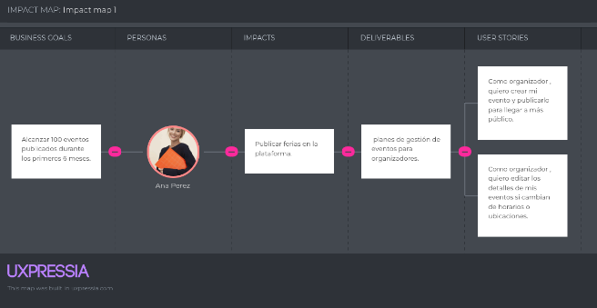

---

## Usuario

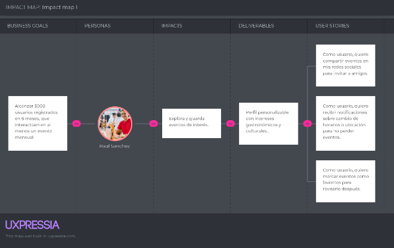

---

# 3.4 Product Backlog

| # Orden | User Story ID | Título | Descripción | Story Points |
|---|---|---|---|---|
| 1 | US06 | Búsqueda por filtros | Filtrar eventos por categoría, fecha y ubicación. | 5 |
| 2 | US08 | Detalle del evento | Ver información completa de eventos. | 3 |
| 3 | US07 | Mapa interactivo | Visualizar eventos en mapa. | 5 |
| 4 | US11 | Compra de entradas | Comprar entradas de forma segura. | 8 |
| 5 | US18 | Publicar evento | Crear eventos y publicarlos. | 5 |
| 6 | US19 | Editar evento | Editar eventos publicados. | 3 |
| 7 | US20 | Mis eventos | Gestionar eventos fácilmente. | 3 |
| 8 | US23 | Registro | Crear cuenta en la plataforma. | 5 |
| 9 | US24 | Login | Iniciar sesión en la plataforma. | 3 |
| 10 | US29 | Notificaciones | Recibir alertas y avisos importantes. | 5 |
| 11 | US12 | Entrada digital | Mostrar entrada digital del usuario. | 3 |
| 12 | US13 | Validación de ticket | Validar tickets en eventos. | 5 |
| 13 | US09 | Favoritos | Guardar eventos favoritos. | 2 |
| 14 | US15 | Recomendaciones | Mostrar eventos sugeridos. | 5 |
| 15 | US31 | Métricas ventas | Visualizar ventas del evento. | 3 |
| 16 | US32 | Métricas alcance | Ver métricas de alcance. | 3 |
| 17 | US33 | Métricas asistencia | Medir asistencia real. | 5 |
| 18 | US22 | Gestión de cupos | Controlar capacidad del evento. | 5 |
| 19 | US14 | Historial de entradas | Consultar compras realizadas. | 2 |
| 20 | US10 | Compartir eventos | Compartir eventos con otros usuarios. | 2 |
| 21 | US16 | Suscripción categorías | Recibir eventos según intereses. | 3 |
| 22 | US30 | Recordatorios | Recibir recordatorios de eventos. | 3 |
| 23 | US25 | Recuperar contraseña | Recuperar acceso a la cuenta. | 2 |
| 24 | US26 | Moderación | Revisar contenido publicado. | 3 |
| 25 | US27 | Roles | Administrar permisos de usuarios. | 3 |
| 26 | US28 | Dashboard admin | Visualizar métricas globales. | 5 |
| 27 | US34 | Cambio idioma app | Cambiar idioma de la aplicación. | 2 |
| 28 | US35 | Traducción eventos | Traducir contenido de eventos. | 3 |
| 29 | US01 | Acceso a la app | Acceder desde la landing page. | 2 |
| 30 | US02 | Cambio idioma landing | Cambiar idioma en landing page. | 2 |
| 31 | US03 | Navegación responsive | Adaptar interfaz a dispositivos. | 3 |
| 32 | US04 | Contenido visual | Mostrar imágenes de eventos. | 2 |
| 33 | US05 | Redes sociales | Acceso a redes sociales. | 1 |
| 34 | US17 | Personalización | Adaptar contenido al usuario. | 3 |
| 35 | US21 | Detalles del evento | Agregar información detallada. | 3 |

# Capítulo IV: Product Architecture Design

## 4.1 Design Concepts, ViewPoints & ER Diagrams

### 4.1.1 Principles Statements

El diseño arquitectónico de NextHappen se fundamenta en principios sólidos de ingeniería de software para garantizar la calidad, mantenibilidad y evolución del sistema a lo largo del tiempo:

*   **SOLID Principles:** Cada componente y microservicio en el backend se diseña respetando el principio de responsabilidad única (SRP), de modo que cada servicio (ej. Gestión de Eventos, Gestión de Usuarios) tenga una sola razón para cambiar. Las interfaces estarán claramente definidas (ISP) para la comunicación entre servicios.
*   **Separation of Concerns (SoC):** Separación estricta entre la capa de presentación (Frontend web y móvil), la capa de negocio (Microservicios) y la capa de persistencia (Bases de datos poli-glotas).
*   **Don't Repeat Yourself (DRY):** La lógica de negocio compartida (como la validación de tokens JWT o configuraciones globales) será centralizada en librerías comunes (Custom Software Library) importables por cada microservicio, o delegadas a componentes de infraestructura como un API Gateway.
*   **Keep It Simple, Stupid (KISS):** A pesar de aplicar una arquitectura de microservicios, las soluciones implementadas (como la mensajería asíncrona) se mantendrán lo más simples posibles hasta que la demanda requiera mayor complejidad, garantizando un "Time to Market" acelerado.
*   **Design for Failure:** Dado que la aplicación está orientada a la nube (Cloud Native), se asume que los componentes pueden fallar. Se aplicarán patrones como Circuit Breaker y Retries para manejar la indisponibilidad de microservicios sin afectar la experiencia general del usuario final.

### 4.1.2 Approaches Statements Architectural Styles & Patterns

Para satisfacer los requisitos funcionales y no funcionales de NextHappen, se ha seleccionado un enfoque híbrido de estilos arquitectónicos:

*   **Arquitectura de Microservicios (Microservices Architecture):** El sistema monolítico inicial será refactorizado y desacoplado en unidades de negocio independientes (Bounded Contexts derivados de Domain-Driven Design). Esto permite el despliegue y escalado independiente de servicios de alta demanda, como el catálogo de eventos o el mapa interactivo.
*   **RESTful APIs & API Gateway Pattern:** Toda comunicación externa desde los clientes (Web App en React/Angular, Mobile App) hacia el backend se realizará mediante APIs RESTful. Se utilizará un API Gateway como único punto de entrada para enrutar, balancear carga y autenticar las peticiones.
*   **Domain-Driven Design (DDD) - Layered Architecture:** Internamente, cada microservicio adoptará una arquitectura de capas (o Hexagonal/Clean Architecture), separando Domain, Application, Infrastructure y Presentation (Controladores REST).
*   **Polyglot Persistence:** Se utilizará un enfoque de persistencia políglota, combinando bases de datos relacionales (ej. PostgreSQL) para datos estructurados con garantías transaccionales (Usuarios, Facturación, Entradas) y bases de datos NoSQL (ej. MongoDB) para datos dinámicos, búsquedas espaciales y altos volúmenes de lectura (Catálogo de eventos, Reseñas).

### 4.1.3 Context Diagram

<p align="center">
  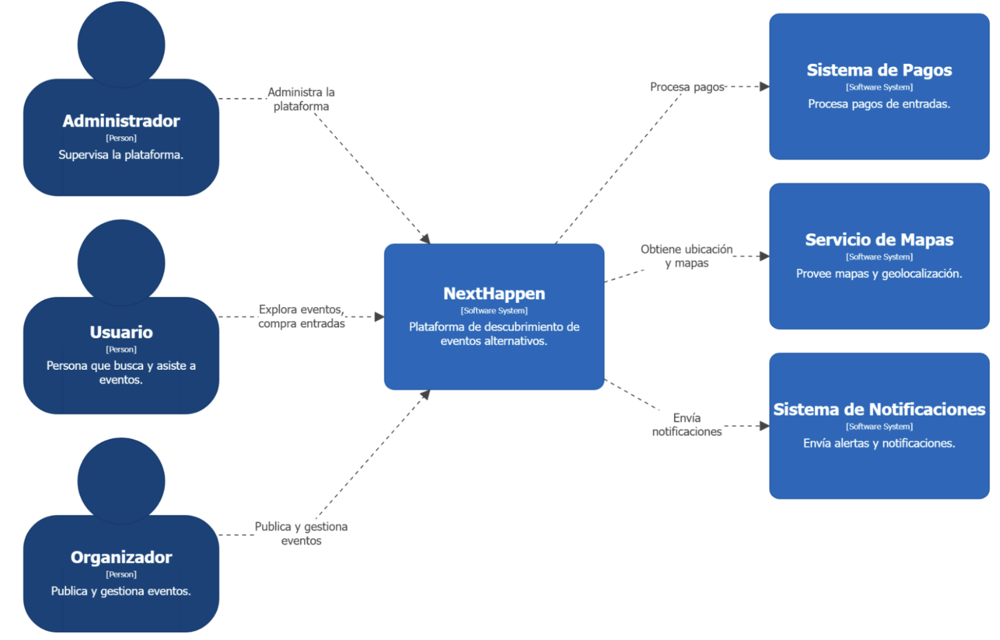
</p>

El diagrama de contexto presenta a NextHappen como el sistema central que interactúa con tres tipos de usuarios: asistentes, organizadores y administradores. Asimismo, se integra con sistemas externos como servicios de pago, mapas y notificaciones, los cuales permiten soportar funcionalidades clave como compra de entradas, geolocalización de eventos y comunicación en tiempo real.

### 4.1.4 Approach driven ViewPoints Diagrams

*   **Diagrama de Clases**

El diagrama de clases representa las entidades principales del dominio siguiendo principios de Domain Driven Design (DDD), mostrando las relaciones entre usuarios, eventos, tickets, categorías y reseñas.

<p align="center">
  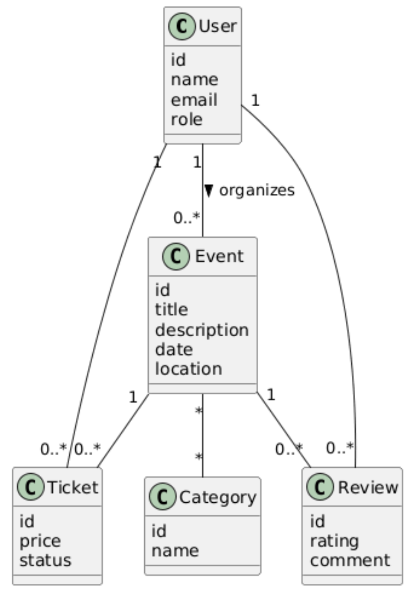
</p>

*   **Diagrama de Actividad**

El diagrama de actividad describe el flujo principal de compra de entradas, incluyendo validación de disponibilidad, procesamiento de pagos y notificación al usuario.

<p align="center">
  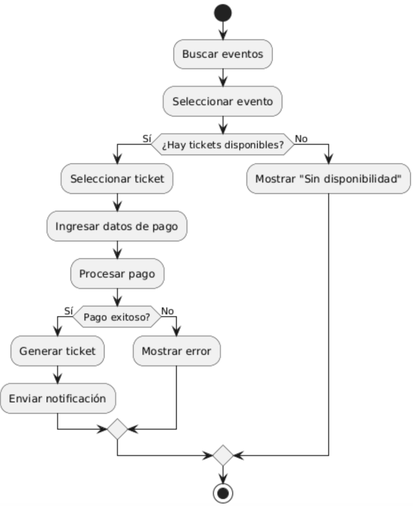
</p>

*   **Diagrama de Estados**

El diagrama de estados modela el ciclo de vida de un ticket, desde su creación hasta su uso o cancelación, permitiendo entender los distintos estados posibles dentro del sistema.

<p align="center">
  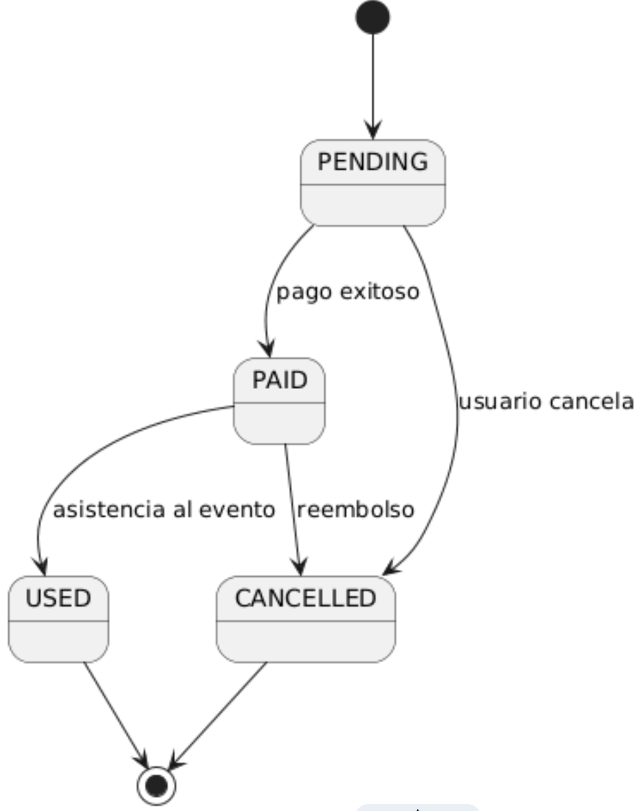
</p>

### 4.1.5 Relational/Non Relational Database Diagram

<p align="center">
  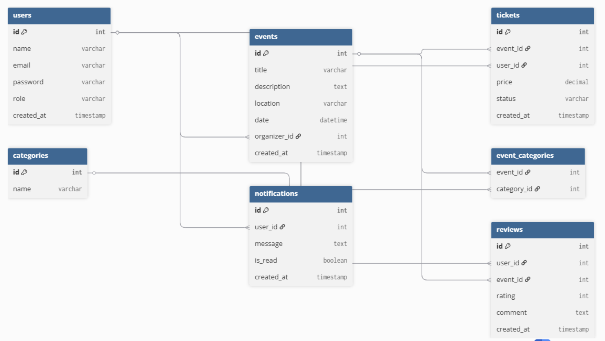
</p>

El diagrama de base de datos representa las entidades principales del sistema NextHappen y sus relaciones. Se identifican entidades como usuarios, eventos, tickets, categorías, reseñas y notificaciones, las cuales permiten soportar las funcionalidades clave del sistema como la gestión de eventos, compra de entradas, personalización y comunicación con los usuarios. Las relaciones entre tablas garantizan la integridad referencial y permiten una correcta organización de la información dentro del sistema.

### 4.1.6 Domain-Driven Design (DDD)

Para garantizar la mantenibilidad y el desacoplamiento en una arquitectura de microservicios, NextHappen adopta los principios de Domain-Driven Design (DDD).

#### 4.1.6.1 Strategic Design

Se han identificado los siguientes **Bounded Contexts** (Contextos Delimitados) que corresponden a los microservicios del sistema:

*   **IAM Context:** Encargado de la seguridad, autenticación y gestión de perfiles de usuario.
*   **Event Management Context:** Núcleo del sistema que gestiona el catálogo de ferias, categorías y geolocalización.
*   **Booking Context:** Gestiona el ciclo de vida de la compra de entradas, stock y procesamiento de pagos.
*   **Engagement Context:** Maneja la interacción social, reseñas y feedback de los usuarios sobre los eventos.
*   **Notification Context:** Responsable de la entrega de alertas push y correos electrónicos mediante eventos de dominio.

**Context Map:** La comunicación entre contextos se realiza principalmente mediante **Customer-Supplier** (ej. Booking depende de Event) y **Published Language** a través del bus de eventos (RabbitMQ).

#### 4.1.6.2 Tactical Design

A continuación se definen los principales **Aggregates** (Agregados) para los contextos clave:

*   **Aggregate: User (IAM Context)**
    *   *Root:* User (Entity)
    *   *Value Objects:* Email, Password (hashed), Role.
*   **Aggregate: FairEvent (Event Context)**
    *   *Root:* Event (Entity)
    *   *Value Objects:* Location (Lat/Long), DateRange, Category.
    *   *Entities:* FairOrganizer.
*   **Aggregate: Ticket (Booking Context)**
    *   *Root:* Ticket (Entity)
    *   *Value Objects:* TicketStatus (Enum), Price, QRCode.

### 4.1.7 Design Patterns

A lo largo del desarrollo de NextHappen, se aplicarán los siguientes patrones de diseño de software (Design Patterns / GoF) y de arquitectura para asegurar la calidad del código:

*   **Creacionales:** Factory Method y Builder para la instanciación compleja de objetos como las respuestas HTTP (DTOs) estandarizadas y la construcción de peticiones a APIs externas. Singleton para la gestión de conexiones a bases de datos y clientes externos de Cloud.
*   **Estructurales:** Data Transfer Object (DTO) para desacoplar el modelo de dominio interno de las representaciones expuestas en las APIs REST. Adapter / Wrapper para la integración de la pasarela de pagos, aislando la lógica específica del proveedor externo del dominio del sistema.
*   **Comportamiento:** Strategy para implementar múltiples estrategias de filtrado y búsqueda de eventos en el mapa. Observer para el sistema de alertas personalizadas, permitiendo a los suscriptores (Web/Mobile App) reaccionar a cambios de estado en un evento (ej. cambio de horario o cancelación).
*   **Patrones Cloud / Microservicios:** Database per Service, API Gateway, y Circuit Breaker (usando herramientas como Resilience4J o Istio).

### 4.1.7 Tactics

Las tácticas arquitectónicas definidas buscan cumplir los principales atributos de calidad del sistema, como rendimiento, seguridad y disponibilidad. Entre las más relevantes se incluyen el uso de caching para optimizar tiempos de respuesta, autenticación y autorización para el control de acceso, procesamiento asíncrono para mejorar la escalabilidad, y mecanismos como retry y circuit breaker para garantizar la resiliencia del sistema.

Estas decisiones se alinean con la arquitectura de microservicios propuesta, permitiendo un sistema más robusto, escalable y mantenible.

## 4.2 Architectural Drivers

### 4.1.8 Design Purpose

El propósito central del diseño arquitectónico de NextHappen es proveer una plataforma altamente disponible, escalable (capaz de manejar picos de tráfico durante los fines de semana cuando hay eventos concurrentes) y geográficamente responsiva (mapas en tiempo real rápidos y precisos). Asimismo, busca ser un entorno seguro para procesar pagos y datos de los emprendedores culturales.

### 4.1.9 Primary Functionality (Primary User Stories)

Las funcionalidades primarias de mayor impacto arquitectónico (por su volumen de transacciones o complejidad) son:

1.  **Descubrimiento y Mapa:** Como usuario asistente, quiero buscar ferias y eventos en un mapa interactivo con información en tiempo real para decidir a dónde ir hoy. (Alta concurrencia, lecturas masivas).
2.  **Gestión de Eventos:** Como organizador, quiero publicar mi evento indicando ubicación, aforo y cambios de última hora, para que todos los interesados sean notificados. (Escrituras asíncronas, notificación push).
3.  **Compra y Gestión de Entradas:** Como usuario asistente, quiero adquirir y descargar una entrada digital segura (código QR), para acceder al evento fácilmente. (Alta confiabilidad, consistencia ACID).

### 4.1.10 Quality Attribute Scenarios

Para validar la arquitectura, se han definido escenarios de atributos de calidad utilizando el formato estándar:

| ID | Atributo | Escenario (Source -> Stimulus -> Artifact -> Environment -> Response -> Measure) |
| :--- | :--- | :--- |
| **QA-1** | **Disponibilidad** | **Fuente:** Usuario final. **Estímulo:** Microservicio de pagos fuera de línea. **Artefacto:** Sistema Central. **Entorno:** Operación normal en fin de semana. **Respuesta:** El sistema activa el modo "Read-Only". **Medida:** El catálogo de eventos sigue disponible para consulta en el 100% de los casos. |
| **QA-2** | **Escalabilidad** | **Fuente:** Redes sociales (viralización). **Estímulo:** Incremento de 500% de peticiones/min. **Artefacto:** Clúster de Microservicios. **Entorno:** Pico de tráfico imprevisto. **Respuesta:** Auto-scaling de instancias .NET. **Medida:** Nueva capacidad operativa en menos de 120 segundos sin pérdida de peticiones. |
| **QA-3** | **Rendimiento** | **Fuente:** Usuario móvil. **Estímulo:** Búsqueda por radio geográfico. **Artefacto:** Event Service + MongoDB. **Entorno:** Conexión 4G/5G. **Respuesta:** Ejecución de consulta espacial optimizada con índices. **Medida:** Tiempo de respuesta (TTFB) menor a 1.5 segundos. |
| **QA-4** | **Seguridad** | **Fuente:** Actor malintencionado. **Estímulo:** Intento de acceso a API de reserva sin token. **Artefacto:** API Gateway. **Entorno:** Operación remota. **Respuesta:** Denegación de acceso (401 Unauthorized). **Medida:** Latencia de validación JWT menor a 300ms. |


### 4.1.11 Constraints

1.  **Tecnológicas:** El desarrollo se restringirá a frameworks modernos y multiplataforma (.NET 9 para el backend, Vue.js para la web y Flutter para móviles) para asegurar un alto rendimiento y facilidad de integración en entornos de contenedores.
2.  **Tiempo (Time to Market):** El proyecto debe desarrollarse e implementarse a nivel funcional en ciclos cortos de 2 a 3 semanas (Sprints), limitando la creación de componentes personalizados en favor de soluciones nativas de la nube administradas (PaaS o SaaS como Azure SQL, MongoDB Atlas).
3.  **Presupuesto Inicial:** La infraestructura debe ser hospedada en proveedores de Cloud Computing (Azure o AWS) utilizando inicialmente la capa gratuita (Free Tier) o créditos académicos, forzando a la arquitectura a ser liviana e eficiente en el uso de recursos de cómputo.


### 4.1.12 Architectural Concerns

*   **DevOps & CI/CD:** El despliegue de microservicios separados requiere un proceso de integración y despliegue continuo automatizado para evitar conflictos de versionamiento (uso de GitFlow y pipelines).
*   **Gestión de Configuración:** Al tener múltiples microservicios, los endpoints externos, credenciales de bases de datos y tokens de pasarelas de pago deben estar centralizados y securizados.
*   **Testing Automatizado (BDD/TDD):** Garantizar la cobertura de pruebas unitarias y de comportamiento en la lógica central (Core Application Suite) para evitar regresiones en cada release.
*   **Observabilidad:** Necesidad de trazabilidad (tracing) y aggregación de logs en todos los microservicios para detectar cuellos de botella y auditar las fallas reportadas por los usuarios.

## 4.3 ADD Iterations

### 4.2.1 Iteration 1: Establishing the Baseline Microservices Architecture

#### 4.3.1.1 Architectural Design Backlog 1

**Objetivo:** Definir la arquitectura base de NextHappen, asegurando que soporte el descubrimiento de eventos y la gestión de identidades con alta disponibilidad y seguridad.

| Id | Tipo | Título/Driver | Descripción | Prioridad |
| :--- | :--- | :--- | :--- | :--- |
| QA-01 | Atributo | Disponibilidad | Garantizar acceso estable durante picos de preventa mediante replicación y balanceo. | Alta |
| QA-02 | Atributo | Escalabilidad | Asegurar la capacidad del sistema para manejar incrementos súbitos en el número de usuarios concurrentes mediante escalado horizontal. | Alta |
| QA-04 | Atributo | Seguridad | Implementar autenticación JWT y cifrado de datos de perfiles y pagos. | Alta |
| US06 | User Story | Búsqueda de Eventos | Como asistente, quiero filtrar ferias por categoría y ubicación para encontrar opciones de interés. | Alta |
| US11 | User Story | Compra de Entradas | Como asistente, quiero realizar la compra de tickets y recibir un comprobante digital. | Alta |
| CON-01 | Restricción | Base Tecnológica | Arquitectura de microservicios desarrollada con Spring Boot. | Alta |

#### 4.3.1.2 Establish Iteration Goal by Selecting Drivers

| Drivers Seleccionados | Resultado Esperado |
| :--- | :--- |
| QA-01 & QA-02 | Microservicios que se pueden replicar (escalar) dinámicamente según la carga de tráfico. |
| QA-04 | Seguridad perimetral en el Gateway para proteger todos los servicios escalados. |
| US06 & US11 | Lógica de negocio distribuida en servicios independientes listos para crecer por separado. |

#### 4.3.1.3 Choose One or More Elements of the System to Refine

En esta fase se seleccionan los elementos de software y de infraestructura que recibirán el diseño detallado para materializar los atributos de calidad de la iteración:

| Elementos del Sistema | Capa / Contexto | Descripción de Refinamiento |
| :--- | :--- | :--- |
| Web App (Vue.js) | Presentación | Interfaz web para que los Organizadores gestionen ferias y los asistentes busquen eventos desde el navegador. |
| Mobile App (Flutter) | Presentación | Aplicación para Asistentes enfocada en la portabilidad, búsqueda rápida (US06) y acceso a tickets QR (US11). |
| API Gateway (YARP / Ocelot) | Infraestructura Perímetro | Configurar como punto único de entrada para aplicar Load Balancing (QA-01) y permitir el Escalado Horizontal (QA-02) redirigiendo tráfico. |
| IAM Service (.NET) | Seguridad Identidad | Implementar la lógica de gestión de identidades y generación de tokens JWT para cumplir con el QA-04. Centraliza el acceso de usuarios (US01). |
| Event Service (.NET) | Negocio Dominio | Refinar el componente de búsqueda y filtrado de la US06. Se diseña para ser un servicio independiente con su propia persistencia para escalar. |
| Booking Service (.NET) | Negocio Persistencia | Diseñar la lógica de reserva y venta de la US11, asegurando la consistencia de datos y la capacidad de respuesta bajo alta concurrencia. |
| RabbitMQ / MassTransit | Infraestructura Mensajería | Establecer la comunicación asíncrona entre microservicios para garantizar el desacoplamiento y la disponibilidad (QA-01). |

#### 4.3.1.4 Choose One or More Design Concepts That Satisfy the Selected Drivers

En esta sección se seleccionan las tácticas y patrones de diseño que permiten cumplir con los atributos de calidad y las historias de usuario priorizadas:

| Driver Seleccionado | Tipo | Concepto de Diseño / Patrón Seleccionado | Justificación |
| :--- | :--- | :--- | :--- |
| QA-01 Disponibilidad | Atributo | Replicación de Servicios + Health Checks | Permite mantener múltiples instancias de los servicios activas; si una falla, el Gateway redirige el tráfico a las instancias sanas. |
| QA-02 Escalabilidad | Atributo | Escalado Horizontal + Stateless Services | Los microservicios de .NET se diseñan sin estado para permitir la adición dinámica de nuevos nodos según la carga de tráfico. |
| QA-04 Seguridad | Atributo | API Gateway + Centralized JWT | Centraliza la validación de identidad en la periferia del sistema, asegurando que solo peticiones autenticadas lleguen a los microservicios de negocio. |
| US11 Compra de Entradas | User Story | Database per Service | Garantiza que el servicio de Booking tenga su propia persistencia (MySQL), evitando cuellos de botella durante transacciones masivas. |

#### 4.3.1.5 Instantiate Architectural Elements, Allocate Responsibilities, and Define Interfaces

Se definen las responsabilidades de los componentes instanciados y sus puntos de interacción (APIs):

| Elemento Arquitectónico | Responsabilidades | Interfaces |
| :--- | :--- | :--- |
| NextHappen Web (Vue.js) | Interfaz administrativa para organizadores y visualización de catálogo para usuarios web. | Browser / REST Consumer |
| NextHappen Mobile (Flutter) | Interfaz móvil optimizada para la experiencia del asistente y validación de entradas mediante QR. | Mobile / REST Consumer |
| API Gateway (.NET / YARP) | Recibir peticiones de Web/Móvil, validar seguridad JWT y balancear carga entre instancias. | HTTP/HTTPS API Gateway |
| Message Broker (RabbitMQ) | Gestionar la cola de mensajes para eventos asíncronos (ej. notificación de entrada comprada). | AMQP / MassTransit |
| IAM Service | Gestionar el registro de usuarios US01, autenticación y generación de tokens de seguridad JWT. | REST: /api/v1/iam |
| Event Service | Proveer la data de las ferias y procesar los filtros de búsqueda de la US06. | REST: /api/v1/events |
| Booking Service | Gestionar el flujo de pago, stock y generación de comprobantes digitales de la US11. | REST: /api/v1/booking |
| MySQL (Instance per service) | Proveer persistencia de datos independiente para cada microservicio para evitar acoplamientos. | Connection String per Service |


#### 4.3.1.6 Sketch Views (C4 & UML) and Record Design Decisions

<p align="center">
  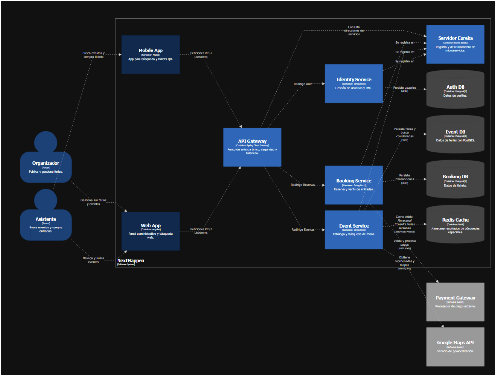
</p>

El diagrama de contenedores presenta una arquitectura de microservicios distribuida, donde la interacción de los usuarios (Asistentes y Organizadores) se canaliza a través de aplicaciones Web (Angular) y Móviles (Flutter) que consumen servicios de forma centralizada mediante un API Gateway. Esta estructura garantiza la Seguridad (QA-04) al validar tokens JWT en el perímetro y promueve la Escalabilidad (QA-02) y Disponibilidad (QA-01) mediante el uso de un Servidor Eureka, que permite el registro y descubrimiento dinámico de instancias para el balanceo de carga. Cada microservicio de negocio —Identity, Event y Booking— gestiona su propia persistencia en bases de datos independientes (PostgreSQL) para evitar acoplamientos y cuellos de botella, integrándose con sistemas externos como Google Maps API para la geolocalización de ferias (US06) y una Pasarela de Pagos para el procesamiento seguro de entradas (US11).

#### 4.3.1.7 Analysis of Current Design and Review Iteration Goal (Kanban Board) (Avance 2)

El Kanban de la primera iteración organizó las actividades de análisis y diseño del sistema. Se avanzó desde el entendimiento del problema hasta la definición de la arquitectura base. Las historias de usuario guiaron las decisiones de diseño.

<p align="center">
  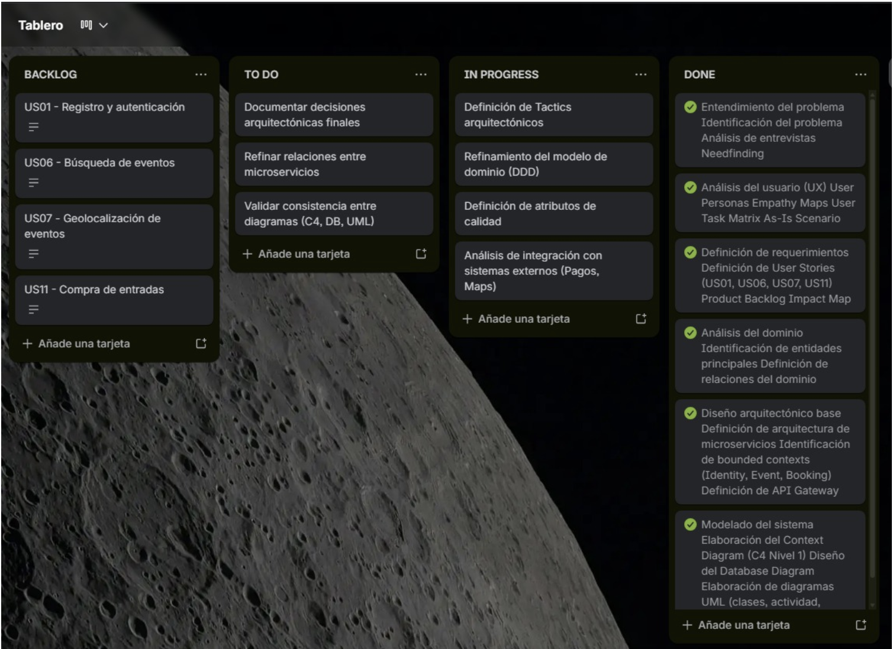
</p>

### 4.2.2 Iteration 2: Events Service (Búsqueda Geolocalizada)

**Objetivo:** Refinar el servicio de eventos para asegurar tiempos de respuesta mínimos (Rendimiento) y capacidad de carga masiva durante búsquedas geolocalizadas mediante el uso de caché y optimización de datos.

#### 4.3.2.1 Architectural Design Backlog 2

Seleccionamos los drivers que impactan directamente en la experiencia de búsqueda.

| Id | Tipo | Título / Driver | Descripción | Prioridad |
| :--- | :--- | :--- | :--- | :--- |
| QA-03 | Atributo | Rendimiento | Latencia menor a 200ms en la recuperación de eventos cercanos mediante caché. | Alta |
| QA-02 | Atributo | Escalabilidad | Procesar ráfagas de consultas de geolocalización concurrentes sin degradar el servicio. | Alta |
| US06 | User Story | Búsqueda de Eventos | Búsqueda eficiente de ferias por ubicación y categoría. | Alta |
| US07 | User Story | Geolocalización | Visualización de eventos en un mapa basados en la posición actual del usuario. | Alta |

#### 4.3.2.2 Establish Iteration Goal by Selecting Drivers

| Drivers Seleccionados | Resultado Esperado |
| :--- | :--- |
| QA-03 (Rendimiento) | Consultas de búsqueda que responden casi instantáneamente gracias a la integración de Redis. |
| QA-02 (Escalabilidad) | El servicio de eventos puede manejar múltiples solicitudes de ubicación simultáneas sin aumentar la latencia. |
| US06 & US07 | Experiencia de usuario fluida donde las ferias se cargan en el mapa en tiempo real según la posición del GPS. |

#### 4.3.2.3 Choose One or More Elements of the System to Refine

En esta iteración nos enfocamos exclusivamente en la pieza de visualización y el motor de búsqueda.

| Elementos del Sistema | Capa / Contexto | Descripción de Refinamiento |
| :--- | :--- | :--- |
| Event Service (Backend) | Negocio / Dominio | Lógica de búsqueda geoespacial y filtros avanzados por categorías. |
| Redis Cache | Infraestructura / Datos | Capa de memoria volátil para almacenar resultados de búsquedas frecuentes. |
| Google Maps API | Integración Externa | Comunicación para obtener coordenadas y renderizado de mapas en tiempo real. |

#### 4.3.2.4 Choose One or More Design Concepts That Satisfy the Selected Drivers

Aplicación de tácticas específicas para optimizar la velocidad.

| Driver Seleccionado | Tipo | Concepto de Diseño / Patrón | Justificación |
| :--- | :--- | :--- | :--- |
| QA-03 Rendimiento | Atributo | Cache-Aside Pattern (Redis) | Reduce el acceso a la base de datos entregando resultados desde memoria. |
| QA-02 Escalabilidad | Atributo | CQRS (Read side) | Separa consultas de lectura de actualizaciones para escalar independientemente. |
| US07 Geolocalización | User Story | Spatial Indexing | Uso de índices geográficos (PostGIS) para optimizar cálculos de distancia. |

#### 4.3.2.5 Instantiate Architectural Elements, Allocate Responsibilities, and Define Interfaces

Definición de responsabilidades y contratos de comunicación.

| Elemento Arquitectónico | Responsabilidades | Interfaces |
| :--- | :--- | :--- |
| EventController | Exponer endpoints de búsqueda y recibir coordenadas (lat/long). | GET /api/v1/events/search |
| Redis Server | Almacenar objetos de "Ferias Cercanas" para evitar re-cálculos costosos. | Redis Sentinel / Jedis |
| Google Maps Integration | Transformar direcciones de texto en coordenadas (Geocoding). | Maps SDK for Mobile/Web |
| Spatial Repository | Consultas SQL optimizadas con operadores geoespaciales (radio de distancia). | Spring Data JPA / PostGIS |

#### 4.3.2.6 Sketch Views (C4 & UML) and Record Design Decisions

<p align="center">
  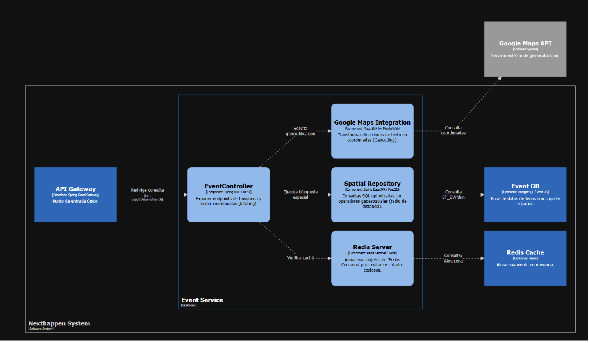
</p>

Este diagrama de componentes del Event Service justifica una arquitectura orientada a la eficiencia y escalabilidad geográfica de la siguiente manera:

El EventController actúa como el punto de entrada principal, desacoplando la recepción de peticiones del procesamiento lógico. La integración con Redis (mediante el componente Redis Server) se justifica por la necesidad de reducir la latencia en búsquedas frecuentes, evitando re-cálculos costosos en la base de datos. Por otro lado, la inclusión de Google Maps Integration permite la flexibilidad de buscar por texto (direcciones), mientras que el Spatial Repository centraliza la complejidad de las consultas SQL de proximidad utilizando operadores de PostGIS. Esta estructura permite que cada componente evolucione de forma independiente, garantizando que el sistema soporte una alta demanda de usuarios buscando ferias en tiempo real.

#### 4.3.2.7 Analysis of Current Design and Review Iteration Goal (Kanban Board) (Avance 2)

El Kanban de la segunda iteración refleja el inicio del desarrollo del sistema. Se implementaron funcionalidades clave sobre la arquitectura definida. Esto permitió avanzar hacia una versión funcional del producto.

<p align="center">
  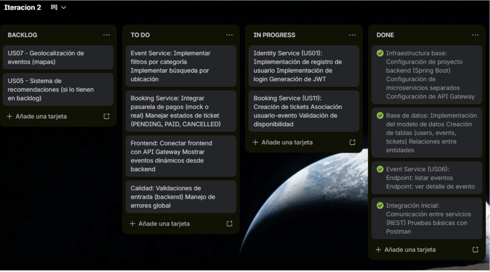
</p>
  
  
  
  # Capítulo V: Product Implementation, Validation & Deployment

## 5.1 Testing Suites & General Patterns

### 5.1.1 Backend Application Core Testing Suite

En esta sección se presentan las funciones de testing planteadas en Xunit y moq para el servicio 
web del proyecto.

Pruebas unitarias: 
Se encuentran primerio las pruebas unitarias de nuestros microservicios. 

Engagement service

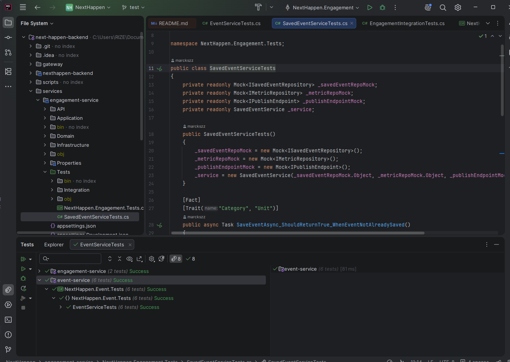

Event service

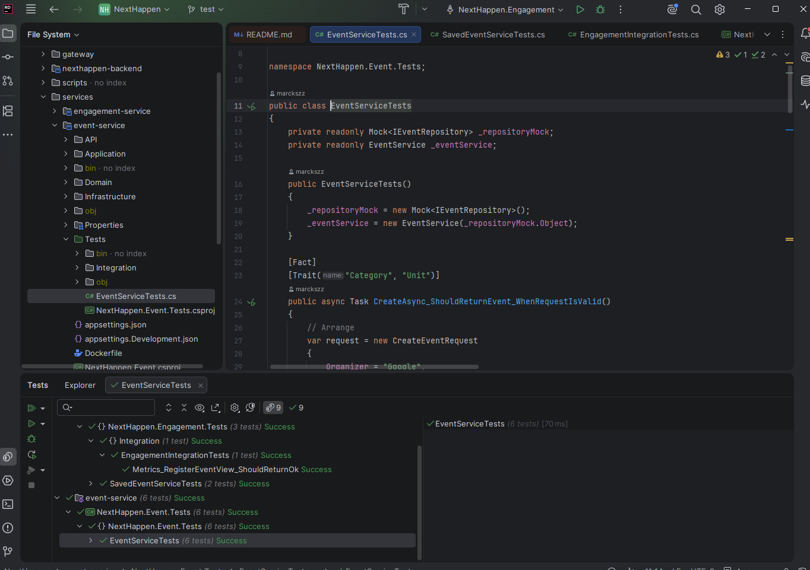

Iam service

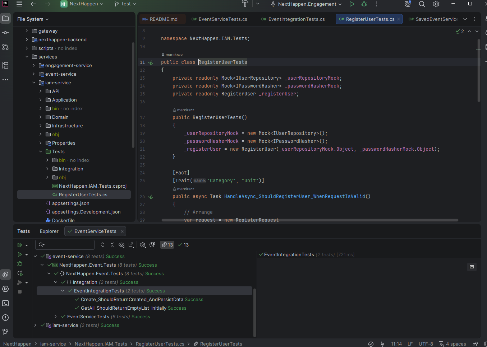

Notification service
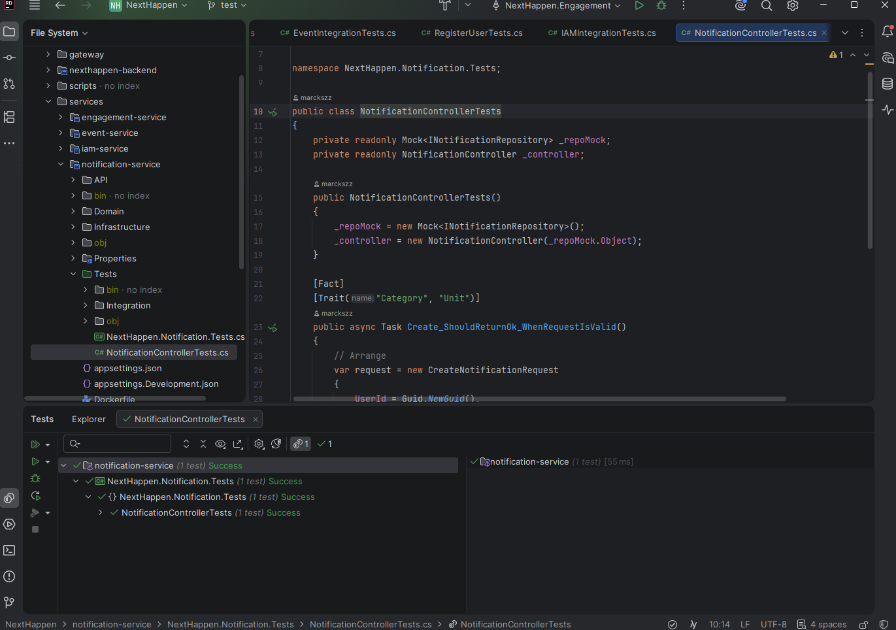

Ticket service

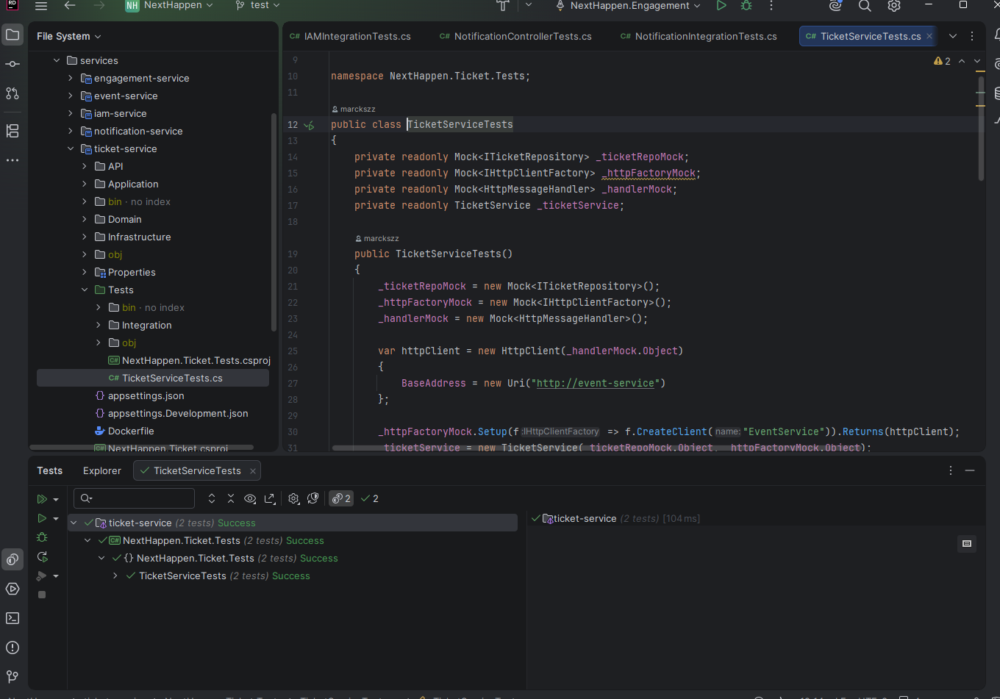

Pruebas integrales: 
Se encuentran las pruebas integrales de nuestros microservicios.

Engagement service
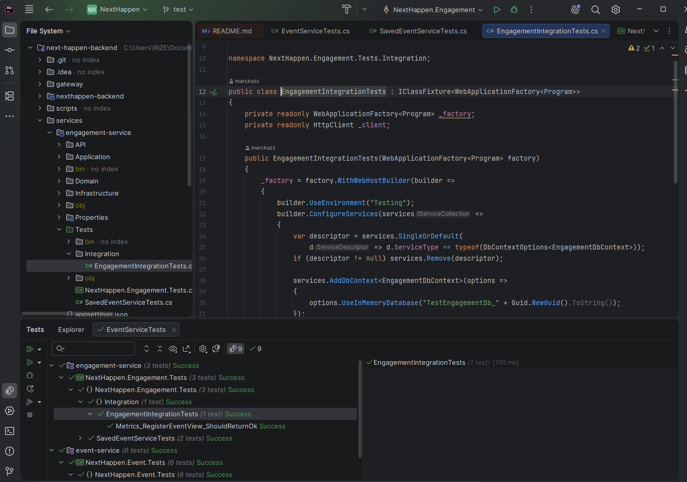
Event service
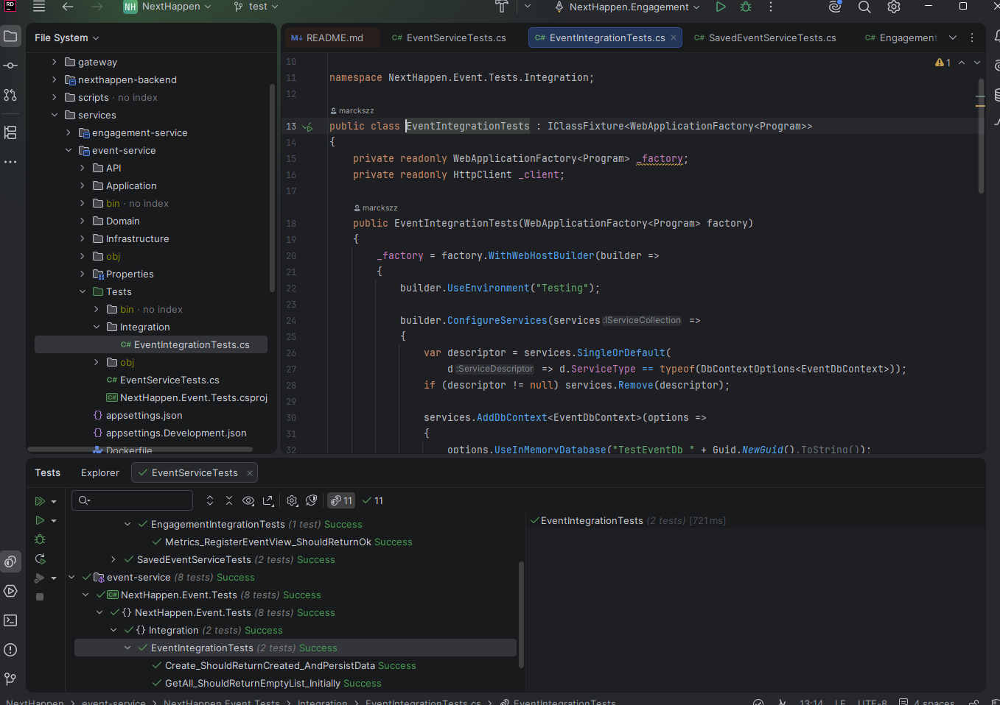
Iam service
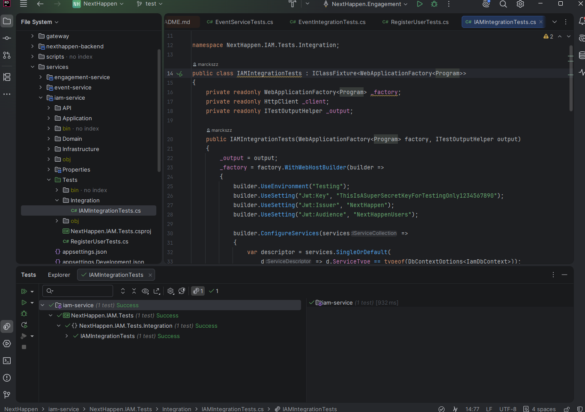
Notification service
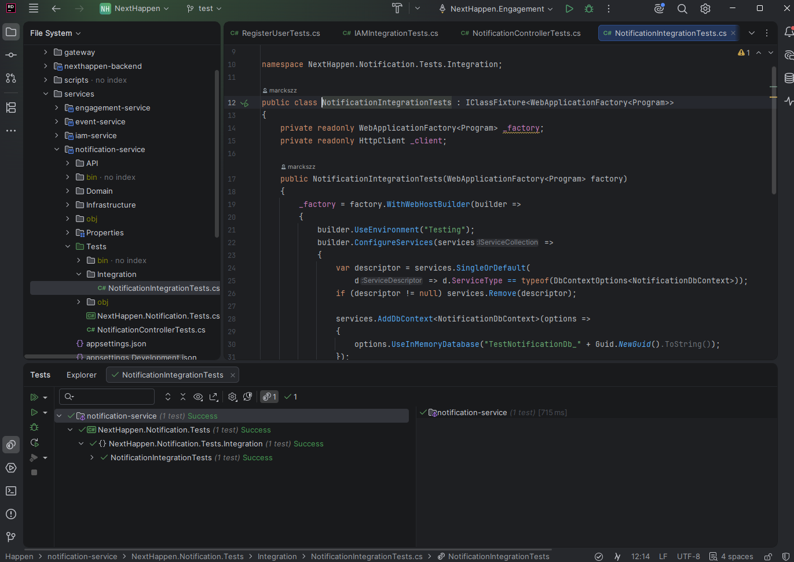
Ticket service
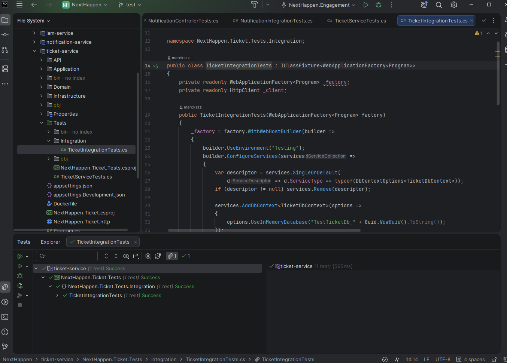

### 5.1.2 Pattern Based Backend Application(s)

En esta sección se detallan los patrones de software y de arquitectura utilizados en los microservicios de la plataforma NextHappen, desarrollados con el framework .NET 9 (ASP.NET Core):

#### Arquitectura en Capas (N-Tier Architecture):

La aplicación se divide en capas con responsabilidades bien definidas: API/Controllers (presentación), Application (lógica de negocio y casos de uso), Domain (entidades y reglas core) e Infrastructure (acceso a datos y persistencia).
Esto garantiza una separación de preocupaciones (Separation of Concerns), permitiendo que cada microservicio sea mantenible y escalable de forma independiente.

#### Patrón de Repositorio (Repository Pattern):

Abstrae la lógica de acceso a datos mediante interfaces, permitiendo que la capa de aplicación interactúe con la persistencia sin conocer los detalles de Entity Framework Core.
En NextHappen, cada microservicio define interfaces en la capa de dominio que son implementadas en la capa de infraestructura, facilitando también la realización de pruebas unitarias mediante mocks.

#### Modelo-Controlador para Web API:

Aunque el proyecto es una API REST, sigue la estructura fundamental de separación de componentes:
Model: Representado por las entidades de dominio que contienen el estado y las reglas del negocio.
DTOs (Data Transfer Objects): Objetos que definen qué información se expone o recibe a través de la API.
Controller: Gestiona las peticiones HTTP, coordina la ejecución de servicios y devuelve respuestas estandarizadas (JSON).
Los controladores en ASP.NET Core actúan como el orquestador de entrada para las peticiones de los clientes.

#### Inyección de Dependencias (Dependency Injection):

Se utiliza el contenedor de dependencias nativo de .NET para gestionar el ciclo de vida de los objetos.
Permite un manejo eficiente de las instancias:
Scoped: Para repositorios y servicios que duran lo que dura una petición HTTP.
Singleton: Para componentes compartidos en toda la ejecución, como generadores de tokens JWT.
Esto reduce el acoplamiento y mejora significativamente la testabilidad del sistema.

#### Assembler / Mapping Pattern:

Se implementa la lógica de conversión entre Entidades de Dominio y DTOs.
Este patrón evita exponer las entidades de la base de datos directamente al cliente, protegiendo la integridad del modelo y permitiendo que la API evolucione independientemente del esquema de datos.

#### Microservices Architectural Style:

El sistema está descompuesto en servicios autónomos (Event, IAM, Ticket, Engagement, Notification) que se comunican de forma síncrona (HTTP/REST) y asíncrona (RabbitMQ/MassTransit).
Cada microservicio posee su propia base de datos (Database-per-Service), cumpliendo con el patrón de aislamiento de datos.

### 5.1.3 Pattern Based Custom Software Library


En esta sección se detallan las dependencias clave del proyecto y su relación con los patrones de diseño de software en el ecosistema .NET:

#### Entity Framework Core (EF Core):

Es el ORM (Object-Relational Mapper) principal que simplifica la persistencia de datos mediante la abstracción del acceso a la base de datos SQL (MySQL en este caso).
Relación con patrones: Implementa el Patrón de Repositorio y Unit of Work, permitiendo que los microservicios manejen transacciones de forma segura y mantengan la Arquitectura en Capas al separar el esquema de datos de la lógica de negocio.

#### MassTransit (RabbitMQ):

Librería de mensajería distribuida que facilita la comunicación asíncrona entre microservicios (por ejemplo, entre Engagement y Notification).
Relación con patrones: Implementa los patrones Publisher/Subscriber (Pub-Sub) y Message Broker, permitiendo un desacoplamiento total entre los servicios y mejorando la resiliencia del sistema.
#### Microsoft.AspNetCore.Authentication.JwtBearer:

Biblioteca estándar para la implementación de seguridad basada en tokens JWT en aplicaciones ASP.NET Core.
Relación con patrones: Se integra con el middleware de la aplicación siguiendo el patrón Interceptor (Middleware), validando las credenciales en cada petición antes de llegar al controlador. La generación del token se centraliza en una clase JwtTokenGenerator registrada como Singleton.
#### BCrypt.Net-Next:

Librería especializada en el hashing seguro de contraseñas utilizando el algoritmo BCrypt.
Relación con patrones: Se utiliza bajo el Patrón de Estrategia (Strategy) a través de una interfaz IPasswordHasher, lo que permite que el microservicio de IAM delegue la responsabilidad de seguridad a un componente especializado y fácilmente intercambiable.
#### xUnit & Moq:

Frameworks utilizados para la creación y ejecución de pruebas automatizadas y la generación de objetos simulados.
Relación con patrones: Facilita la aplicación del patrón Triple A (Arrange, Act, Assert) y el uso de Mocking, permitiendo validar la integridad de la lógica de negocio en aislamiento sin depender de recursos externos como la base de datos real.

### 5.1.4 Framework Pattern Driven Refactoring Report

En esta sección se detallan las mejoras aplicadas a la arquitectura de los microservicios de NextHappen a partir de la refactorización guiada por patrones de diseño y las mejores prácticas de ASP.NET Core:

#### Arquitectura en Capas (N-Tier):

Se reorganizó el código en capas de API, Application, Domain e Infrastructure. Esto garantiza una separación clara de responsabilidades, facilitando el mantenimiento y permitiendo que cada capa evolucione de forma independiente.

#### Abstracción mediante Repositorios:

Se implementaron interfaces para todos los repositorios, desacoplando la lógica de negocio de la persistencia física en MySQL. Esto permite cambiar el motor de base de datos o realizar pruebas unitarias sin afectar el núcleo del sistema.

#### Implementación de DTOs (Data Transfer Objects):

Se introdujeron DTOs para todas las entradas y salidas de la API. Esto evita la exposición de las entidades de dominio y protege la integridad de los datos, controlando exactamente qué campos se envían al cliente.

#### Gestión Centralizada de Dependencias (DI):

Se refactorizó el registro de servicios para utilizar el contenedor de Inyección de Dependencias nativo de .NET. Se definieron ciclos de vida adecuados (Scoped para servicios de aplicación y Singleton para utilitarios de seguridad), optimizando el uso de memoria y recursos.

#### Simplificación de Controladores (Clean Controllers):

Siguiendo el patrón de controladores delgados (Thin Controllers), se delegó toda la lógica compleja de negocio a la capa de Servicios o Casos de Uso. Los controladores ahora solo se encargan de la validación básica de la petición y de retornar el código de estado HTTP adecuado.

#### Lógica de Mapeo (Assembler):

Se incorporaron métodos de mapeo para la transformación entre entidades y DTOs. Esto redujo la duplicación de código en los controladores y mejoró la legibilidad al centralizar la lógica de transformación.
Infraestructura de Pruebas (Test-Driven Refactoring):

Se añadió una suite de Pruebas Unitarias e Integrales utilizando xUnit y Moq. La refactorización incluyó la adopción del patrón Triple A (Arrange, Act, Assert), asegurando que cada funcionalidad nueva o existente esté respaldada por pruebas automatizadas confiables.

## 5.2 Software Configuration Management

La gestión de configuración de software en NextHappen tiene como objetivo garantizar el control, seguimiento y estabilidad del desarrollo de la aplicación web y sus microservicios. Para ello, el equipo definió herramientas, estándares y procesos que permiten mantener consistencia en el código, facilitar el trabajo colaborativo y asegurar despliegues confiables utilizando contenedores Docker.

La estrategia de Software Configuration Management (SCM) aplicada contempla la configuración del entorno de desarrollo, la administración del código fuente mediante Git y GitHub, el uso de convenciones de codificación para mantener calidad y mantenibilidad, y la configuración automatizada del despliegue de los servicios.

---

### 5.2.1 Software Development Environment Configuration

Para el desarrollo del proyecto NextHappen se configuró un entorno moderno orientado al desarrollo web basado en microservicios utilizando tecnologías .NET y Vue.js.

### Herramientas utilizadas

| Herramienta | Propósito |
|---|---|
| Visual Studio 2022 | Desarrollo Backend en C# |
| Visual Studio Code | Desarrollo Frontend |
| Vue.js | Desarrollo de interfaz web |
| .NET 8 | Desarrollo de APIs REST |
| MySQL | Persistencia de datos |
| Docker | Contenerización de servicios |
| Git | Control de versiones |
| GitHub | Repositorio remoto |
| Trello | Gestión ágil del proyecto |
| Postman | Pruebas de APIs |

### Configuración del entorno

El entorno fue configurado siguiendo los siguientes pasos:

1. Instalación de Visual Studio 2022 con soporte para ASP.NET Core.
2. Instalación de Node.js y Vue CLI.
3. Configuración de Docker Desktop.
4. Instalación y configuración de MySQL Server.
5. Clonación del repositorio desde GitHub.
6. Restauración de dependencias mediante NuGet y npm.
7. Configuración de variables de entorno mediante archivos `.env`.
8. Ejecución local de frontend y backend.

### Configuración del backend

El backend fue desarrollado utilizando ASP.NET Core Web API en .NET 8.

### Dependencias principales

```bash
Microsoft.EntityFrameworkCore
Pomelo.EntityFrameworkCore.MySql
Swashbuckle.AspNetCore
AutoMapper
```

### Configuración del frontend

El frontend utiliza Vue.js como framework principal.

### Dependencias principales

```bash
vue
vue-router
pinia
axios
```

### Beneficios del entorno configurado

- Compatibilidad entre todos los integrantes.
- Desarrollo modular y escalable.
- Facilidad de pruebas locales.
- Integración rápida mediante Docker.
- Separación clara entre frontend y backend.

---

## 5.2.2 Source Code Management

La gestión del código fuente se realizó utilizando Git como sistema de control de versiones distribuido y GitHub como plataforma colaborativa.

### Estrategia de ramas

El equipo utilizó una estrategia basada en Git Flow simplificado.

| Rama | Propósito |
|---|---|
| `main` | Versión estable del proyecto |
| `develop` | Integración de funcionalidades |
| `feature/*` | Nuevas funcionalidades |
| `hotfix/*` | Correcciones urgentes |

### Flujo de trabajo

1. Cada integrante creaba una rama `feature`.
2. Se desarrollaban funcionalidades localmente.
3. Los cambios eran registrados mediante commits descriptivos.
4. Se realizaban Pull Requests hacia `develop`.
5. El código era revisado antes de aprobarse.
6. Las versiones estables eran integradas en `main`.

### Convenciones de commits

El equipo utilizó commits descriptivos para mantener trazabilidad.

```bash
feat: agregar gestión de eventos
fix: corregir autenticación JWT
docs: actualizar README
refactor: optimizar servicio de usuarios
```

### Gestión ágil del proyecto

El seguimiento de tareas y avances fue realizado mediante Trello.

### Uso de Trello

- Gestión del Product Backlog.
- Organización de tareas por Sprint.
- Seguimiento del progreso del equipo.
- Control visual de actividades pendientes y completadas.

## Beneficios obtenidos

- Mejor organización del trabajo colaborativo.
- Historial claro de cambios.
- Reducción de conflictos entre desarrolladores.
- Mayor control sobre versiones del software.

---

## 5.2.3 Source Code Style Guide & Conventions

Con el objetivo de mantener calidad, legibilidad y mantenibilidad, el equipo estableció convenciones de codificación para frontend y backend.

## Convenciones generales

- Uso de nombres descriptivos.
- Código modular y reutilizable.
- Separación de responsabilidades.
- Evitar duplicidad de código.
- Documentación básica en métodos importantes.

---

## Backend (.NET / C#)

### Convenciones aplicadas

| Elemento | Convención |
|---|---|
| Clases | PascalCase |
| Variables | camelCase |
| Interfaces | Prefijo `I` |
| Métodos | PascalCase |
| Constantes | UPPER_CASE |

### Ejemplo

```csharp
public class EventService : IEventService
{
    public async Task<EventDto> GetEventById(int id)
    {
        return await _repository.FindById(id);
    }
}
```

---

## Frontend (Vue.js)

### Convenciones aplicadas

| Elemento | Convención |
|---|---|
| Componentes | PascalCase |
| Variables | camelCase |
| Archivos Vue | PascalCase |
| Rutas | kebab-case |

### Ejemplo

```javascript
const fetchEvents = async () => {
  const response = await api.get('/events');
  return response.data;
};
```

---

## Herramientas de calidad

| Herramienta | Función |
|---|---|
| ESLint | Validación de código JavaScript |
| Prettier | Formateo automático |
| StyleCop | Convenciones C# |
| Swagger | Documentación de APIs |

## Beneficios

- Código uniforme y fácil de entender.
- Mayor mantenibilidad.
- Facilidad para realizar revisiones de código.
- Reducción de errores de desarrollo.

---

## 5.4 Software Deployment Evidence

El despliegue final de NextHappen se realiza siguiendo un enfoque **Cloud-Native**, asegurando que la arquitectura de microservicios sea resiliente y escalable en producción.

### 5.4.1 Cloud Architecture

La solución se hospeda en **Microsoft Azure**, utilizando los siguientes servicios para soportar la infraestructura:

*   **Azure Kubernetes Service (AKS):** Orquestación de los contenedores de los microservicios (.NET), permitiendo el escalado automático basado en la demanda (QA-02).
*   **Azure SQL Database:** Persistencia relacional para los microservicios de IAM y Booking, utilizando el patrón *Database-per-Service*.
*   **Azure Cosmos DB (MongoDB API):** Para el almacenamiento de datos geoespaciales y el catálogo de eventos, optimizando las consultas del Event Service (QA-03).
*   **Azure Container Registry (ACR):** Almacenamiento privado de las imágenes Docker de cada servicio.
*   **Azure Front Door / Application Gateway:** Actúa como el API Gateway perimetral para balanceo de carga global y seguridad WAF.

### 5.4.2 CI/CD Pipelines

Se implementaron flujos de **GitHub Actions** para automatizar el ciclo de vida del software:

1.  **Integración Continua (CI):** En cada *Pull Request* hacia la rama `develop`, se ejecutan las pruebas unitarias (xUnit) y el análisis de código estático (SonarCloud).
2.  **Despliegue Continuo (CD):** Tras la aprobación, se genera la imagen Docker, se sube al ACR y se actualiza el manifiesto de Kubernetes en AKS de forma automática.

### 5.4.3 Evidence of Deployment

*(Aquí se incluirían capturas del portal de Azure, los logs de los pods en ejecución y el enlace a la aplicación desplegada)*

[Enlace a la aplicación NextHappen (Producción)](https://nexthappen-prod.azurewebsites.net)

---

## 5.3 Microservices Implementation

La implementación de microservicios en NextHappen fue realizada siguiendo una arquitectura desacoplada basada en servicios independientes desarrollados con ASP.NET Core Web API. Cada microservicio fue diseñado para cumplir responsabilidades específicas del negocio, permitiendo escalabilidad, mantenibilidad y despliegue independiente.

Durante el Sprint 1 se desarrollaron las funcionalidades iniciales relacionadas con autenticación, gestión de eventos y configuración base del sistema.

---

### 5.3.1 Sprint 1

#### 5.3.1.1 Sprint Planning 1

En esta sección se especifica los aspectos principales del Sprint Planning Meeting. Se inicia la sección con una introducción y a continuación se coloca el cuadro de resumen del sprint planning meeting.

| Sprint # | Sprint 1 |
| :--- | :--- |
| **Sprint Planning Background** | |
| Date | 2026-04-15 |
| Time | 09:00 AM |
| Location | Virtual (Google meet) |
| Prepared By | Nakasone Gomes, Marco Antonio |
| **Attendees (to planning meeting)** | Cabanillas Meza, Jose Mateo / Nakasone Gomes, Marco Antonio / Carhuancote Domminguez, Gonzalo Alonso |
| **Sprint n - 1 Review Summary** | N/A (Primer Sprint del proyecto) |
| **Sprint n - 1 Retrospective Summary** | N/A (Primer Sprint del proyecto) |
| **Sprint Goal & User Stories** | |
| Sprint 1 Goal | Implementar la primera versión funcional de NextHappen mediante una arquitectura basada en microservicios, permitiendo el registro y autenticación de usuarios, la gestión básica de eventos y la documentación inicial de los servicios para su integración futura. |
| Sprint 1 Velocity | 41 Story Points |
| Sum of Story Points | 41 |

Durante la Sprint Planning Meeting se revisó el Product Backlog priorizado y se seleccionaron las User Stories relacionadas con autenticación, registro de usuarios y gestión inicial de eventos. Asimismo, se acordó implementar la estructura base de la arquitectura de microservicios siguiendo principios de Domain-Driven Design (DDD), con el objetivo de disponer de una base escalable para futuros incrementos del producto.
---

#### 5.3.1.2 Sprint Backlog 1

El Sprint Backlog incluye la descomposición de las User Stories seleccionadas en tareas técnicas (Work-Items), con sus respectivas estimaciones, responsables y estado de avance.

| User Story                 | Story Points | Work-Item / Task                  | Description                                                                    | Assigned To | Status |
| -------------------------- | ------------ | --------------------------------- | ------------------------------------------------------------------------------ | ----------- | ------ |
| US23: Registro             | 3            | T01.01 User Registration Endpoint | Implementar endpoint para registro de usuarios y persistencia de datos.        | Gonzalo     | Done   |
| US23: Registro             | 2            | T01.02 Validation Rules           | Implementar validaciones de correo electrónico, unicidad y datos obligatorios. | Gonzalo     | Done   |
| US24: Login                | 5            | T02.01 JWT Authentication         | Implementar generación y validación de tokens JWT.                             | Mateo       | Done   |
| US24: Login                | 3            | T02.02 Login Endpoint             | Implementar autenticación y validación de credenciales.                        | Mateo       | Done   |
| US06: Búsqueda por filtros | 8            | T03.01 Event Query Service        | Implementar consultas de eventos por categoría y fecha.                        | Marco       | Done   |
| US08: Detalle del evento   | 2            | T03.02 Event Detail Endpoint      | Implementar consulta detallada de eventos.                                     | Marco       | Done   |
| US07: Mapa interactivo     | 5            | T03.03 Event Location Support     | Implementar soporte geográfico para eventos.                                   | Marco       | Done   |
| US18: Publicar evento      | 8            | T04.01 Event Creation Service     | Implementar creación y publicación de eventos.                                 | Gonzalo     | Done   |
| US19: Editar evento        | 5            | T04.02 Event Update Service       | Implementar actualización de eventos existentes.                               | Mateo       | Done   |


Como resultado de la Sprint Planning Meeting, se seleccionaron User Stories relacionadas con la autenticación y gestión de eventos, debido a que representan las funcionalidades esenciales para la operación inicial de la plataforma. Estas historias permitieron validar la arquitectura propuesta y establecer la base para los siguientes incrementos del producto.

#### Entregables Arquitectónicos del Sprint

| Entregable Técnico | Estado |
|------------|------------|
| IAM Microservice | Implementado |
| Event Management Microservice | Implementado |
| JWT Authentication | Implementado |
| Swagger/OpenAPI Documentation | Implementado |
| Arquitectura inicial basada en Microservices | Implementado |
| Estructura DDD por Bounded Context | Implementado |
| Repositorio Backend Inicial | Implementado |

---

#### 5.3.1.3 Development Evidence for Sprint Review

Durante el Sprint 1 se desarrollaron las funcionalidades fundamentales de la plataforma NextHappen relacionadas con autenticación de usuarios y gestión de eventos. Asimismo, se implementó la estructura inicial de la arquitectura basada en microservicios siguiendo principios de Domain-Driven Design (DDD). El desarrollo fue gestionado mediante GitHub utilizando control de versiones y commits incrementales.

##### Development Commits

| Repository          | Branch | Commit ID | Commit Message               | Description                                                              | Committed On |
| ------------------- | ------ | --------- | ---------------------------- | ------------------------------------------------------------------------ | ------------ |
| next-happen-backend | master | 12dba5e   | Initial Microservices Setup  | Configuración inicial de la arquitectura basada en microservicios.       | 2026-05-14   |
| next-happen-backend | master | 2c157a1   | IAM Microservice             | Implementación del microservicio de autenticación y gestión de usuarios. | 2026-05-14   |
| next-happen-backend | master | a985d7a   | Event Microservice           | Implementación del microservicio de gestión de eventos.                  | 2026-05-14   |
| next-happen-backend | master | 12857b7   | JWT Authentication and Roles | Implementación de autenticación JWT y gestión de roles.                  | 2026-05-14   |
| next-happen-backend | master | 1c6c95a   | Swagger Integration          | Integración de documentación OpenAPI/Swagger para los servicios REST.    | 2026-05-14   |

##### Development Results

| Component                | Result      |
| ------------------------ | ----------- |
| IAM Service              | Implemented |
| Event Service            | Implemented |
| JWT Authentication       | Implemented |
| Role Management          | Implemented |
| Swagger/OpenAPI          | Implemented |
| Initial DDD Architecture | Implemented |
| REST APIs                | Implemented |

##### Development Evidence

Figure 5.3.1.3.1 - GitHub commit history for Sprint 1.
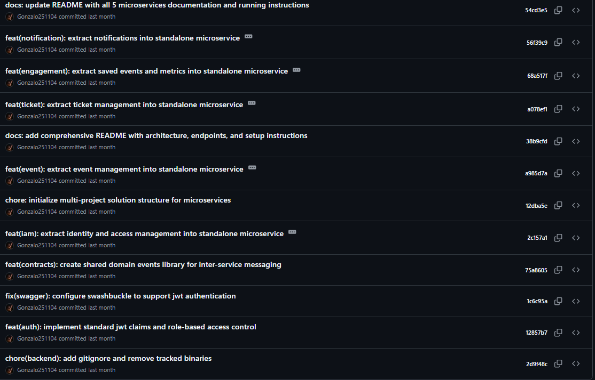

Figure 5.3.1.3.2 - Backend microservices project structure.
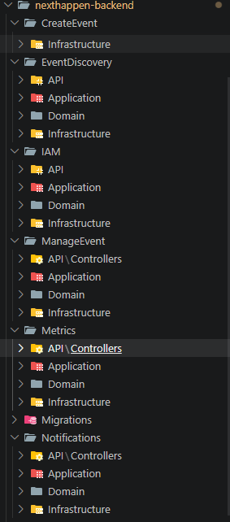


---

#### 5.3.1.4 Testing Suite Evidence for Sprint Review


Durante el Sprint 1 se implementaron pruebas unitarias e integrales para validar el correcto funcionamiento de los componentes desarrollados. Las pruebas permitieron verificar los principales flujos de autenticación, gestión de usuarios y servicios asociados, asegurando el cumplimiento de los requerimientos funcionales definidos para el sprint.

##### Testing Commits

| Repository          | Branch | Commit ID | Commit Message               | Description                                                                                    | Committed On |
| ------------------- | ------ | --------- | ---------------------------- | ---------------------------------------------------------------------------------------------- | ------------ |
| next-happen-backend | test   | 482e481   | feat: unit and integral test | Implementación de pruebas unitarias e integrales para los componentes principales del backend. | 2026-05-14   |


Figure 5.3.1.4.1 - GitHub commit associated with unit and integration tests.


Figure 5.3.1.4.2 - Test execution results.


---

#### 5.3.1.5 Execution Evidence for Sprint Review

Durante el Sprint 1 se ejecutaron pruebas funcionales sobre los servicios implementados con el fin de validar el correcto comportamiento de los endpoints desarrollados. Las pruebas fueron realizadas utilizando Swagger y Postman, verificando los flujos principales de autenticación y gestión de eventos.

##### Executed Functionalities

| Functionality     | Endpoint                  | Result  |
| ----------------- | ------------------------- | ------- |
| User Registration | POST /api/v1/auth/sign-up | Success |
| User Login        | POST /api/v1/auth/sign-in | Success |
| Event Retrieval   | GET /api/v1/events        | Success |
| Event Detail      | GET /api/v1/events/{id}   | Success |
| Event Creation    | POST /api/v1/events       | Success |

##### Execution Results

| Validation                               | Status |
| ---------------------------------------- | ------ |
| User registration completed successfully | Passed |
| JWT token generation                     | Passed |
| User authentication                      | Passed |
| Event listing retrieval                  | Passed |
| Event creation process                   | Passed |


- **Postman Evidence:** Se realizaron pruebas de los endpoints de `/auth/login` y `/events` obteniendo respuestas exitosas (200 OK).
- **Video Evidence:** [Enlace al video de ejecución del Sprint 1](https://youtube.com/link-placeholder)

<p align="center">
  
</p>

---

#### 5.3.1.6 Microservices Documentation Evidence for Sprint Review


Durante el Sprint 1 se documentaron los microservicios implementados utilizando OpenAPI/Swagger, permitiendo visualizar y validar los contratos REST de cada bounded context desarrollado. Esta documentación facilita la integración entre servicios y proporciona una referencia para futuras iteraciones del proyecto.

##### Documented Microservices

| Microservice         | Documentation Technology | Status    |
| -------------------- | ------------------------ | --------- |
| IAM Service          | Swagger / OpenAPI        | Available |
| Event Service        | Swagger / OpenAPI        | Available |
| Ticket Service       | Swagger / OpenAPI        | Available |
| Engagement Service   | Swagger / OpenAPI        | Available |
| Notification Service | Swagger / OpenAPI        | Available |

##### Swagger Endpoints

| Microservice | Swagger URL                                   |
| ------------ | --------------------------------------------- |
| Service 1    | http://159.112.143.58:5001/swagger/index.html |
| Service 2    | http://159.112.143.58:5002/swagger/index.html |
| Service 3    | http://159.112.143.58:5003/swagger/index.html |
| Service 4    | http://159.112.143.58:5004/swagger/index.html |
| Service 5    | http://159.112.143.58:5005/swagger/index.html |

#### Documentation Evidence

Figure 5.2.1.6.1 - Swagger documentation for IAM Service.

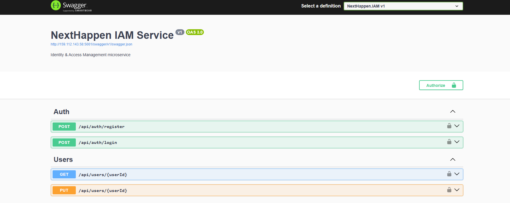

Figure 5.2.1.6.2 - Swagger documentation for Event Service.

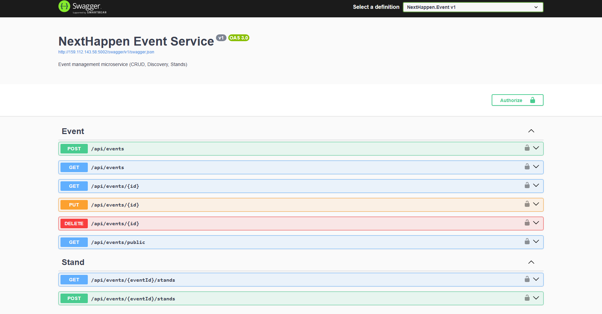

---

#### 5.3.1.7 Software Deployment Evidence for Sprint Review

Durante el Sprint 1 se realizó el despliegue inicial de la solución utilizando contenedores Docker. La arquitectura implementada permitió ejecutar de manera independiente los diferentes microservicios de la plataforma, facilitando la escalabilidad, mantenibilidad y despliegue de futuras versiones.

La solución fue desplegada sobre un servidor Linux Ubuntu, donde cada bounded context fue ejecutado como un contenedor independiente. Asimismo, se configuró un API Gateway para centralizar el acceso a los servicios expuestos.

##### Deployment Components

| Component            | Deployment Technology | Status  |
| -------------------- | --------------------- | ------- |
| API Gateway          | Docker Container      | Running |
| IAM Service          | Docker Container      | Running |
| Event Service        | Docker Container      | Running |
| Ticket Service       | Docker Container      | Running |
| Engagement Service   | Docker Container      | Running |
| Notification Service | Docker Container      | Running |

##### Deployment Results

| Validation                                | Result |
| ----------------------------------------- | ------ |
| Containers successfully deployed          | Passed |
| Services accessible through exposed ports | Passed |
| API Gateway operational                   | Passed |
| Microservices execution verified          | Passed |
| Swagger documentation available           | Passed |

##### Deployment Evidence

Figure 5.2.1.7.1 - Docker containers deployed on Ubuntu server.

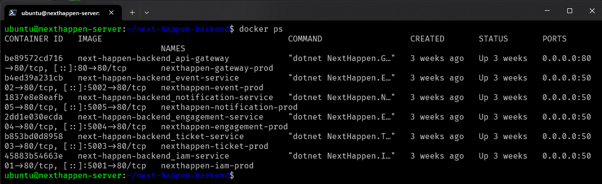


---

#### 5.3.1.8 Team Collaboration Insights during Sprint

Durante el Sprint 1, el equipo trabajó de manera colaborativa utilizando GitHub para el control de versiones y Microsoft Teams/Discord para la coordinación de actividades. La distribución de responsabilidades permitió desarrollar de forma paralela las funcionalidades relacionadas con autenticación, gestión de eventos y arquitectura base de microservicios.

La comunicación constante entre los integrantes facilitó la integración de los componentes desarrollados, así como la resolución temprana de problemas técnicos asociados a la implementación de la arquitectura distribuida.

##### Team Contribution Summary

| Team Member                          | Main Contributions                                                                                                       |
| ------------------------------------ | ------------------------------------------------------------------------------------------------------------------------ |
| Gonzalo Alonso Carhuancote Domínguez | Implementación del registro de usuarios, creación y actualización de eventos, soporte en arquitectura de microservicios. |
| Jose Mateo Cabanillas Meza           | Implementación de autenticación JWT, login, validación de credenciales y pruebas funcionales.                            |
| Marco Antonio Nakasone Gomes         | Implementación de consultas de eventos, soporte geográfico y coordinación de documentación técnica.                      |

##### Sprint Insights

| Aspect            | Observation                                                                        |
| ----------------- | ---------------------------------------------------------------------------------- |
| Communication     | Effective communication through virtual meetings and messaging tools.              |
| Task Distribution | Responsibilities were distributed according to technical specialization.           |
| Integration       | Successful integration of developed microservices.                                 |
| Challenges        | Initial configuration of the microservices architecture and service communication. |
| Lessons Learned   | Early integration and frequent code reviews reduced development risks.             |

---

#### 5.3.1.9 Kanban Board 

El tablero Kanban refleja el flujo de trabajo desde el Backlog hasta el estado de Finalizado.

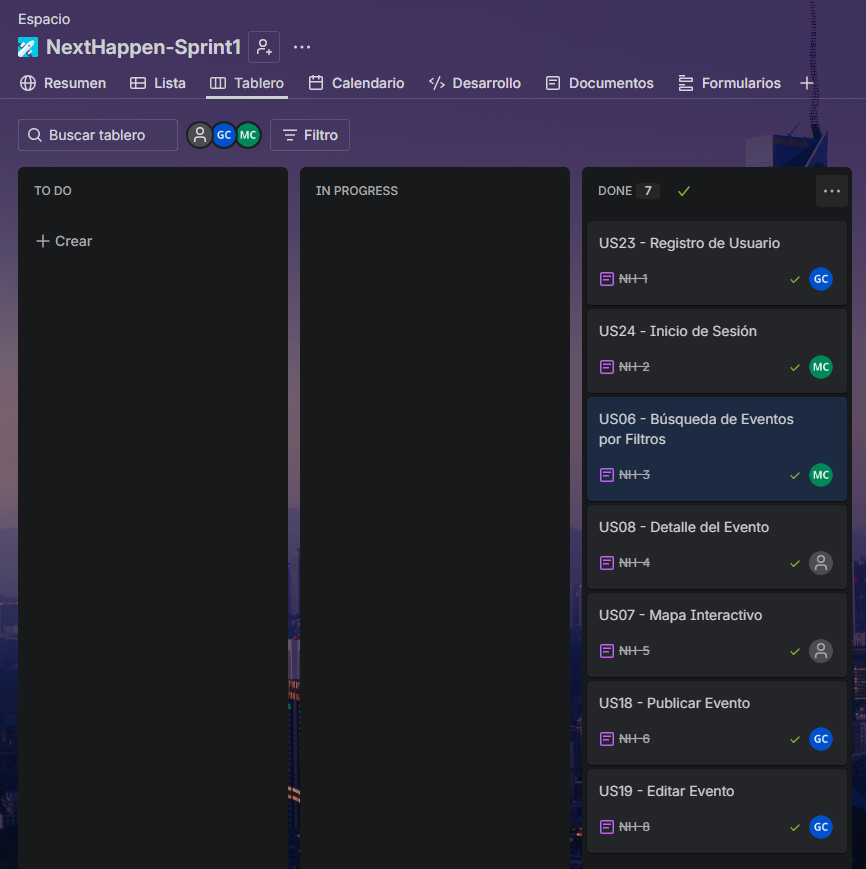


---

### 5.3.2 Sprint 2

#### 5.3.2.1 Sprint Planning 2

En esta sección se especifican los aspectos principales del Sprint Planning Meeting para el segundo ciclo de desarrollo.

| Sprint # | Sprint 2 |
| :--- | :--- |
| **Sprint Planning Background** | |
| Date | 2026-05-15 |
| Time | 09:00 AM |
| Location | Virtual (Discord / Microsoft Teams) |
| Prepared By | Nakasone Gomes, Marco Antonio |
| **Attendees (to planning meeting)** | Cabanillas Meza, Jose Mateo / Nakasone Gomes, Marco Antonio / Carhuancote Domminguez, Gonzalo Alonso |
| **Sprint n - 1 Review Summary** | Se completó con éxito la arquitectura base, el IAM Service y el Event Service básico. La integración con el frontend de Vue.js fue exitosa. |
| **Sprint n - 1 Retrospective Summary** | El equipo mejoró la comunicación en el uso de Pull Requests. Se identificó la necesidad de mejorar la documentación de los eventos de RabbitMQ. |
| **Sprint Goal & User Stories** | |
| Sprint 2 Goal | Implementar el flujo completo de compra de entradas (Booking), sistema de reseñas (Engagement) y envío de alertas (Notifications) mediante mensajería asíncrona. |
| Sprint 2 Velocity | 30 Story Points |
| Sum of Story Points | 28 |

---

#### 5.3.2.2 Sprint Backlog 2

| User Story | Work-Item / Task | Description | Estimation (Hours) | Assigned To | Status |
| :--- | :--- | :--- | :--- | :--- | :--- |
| **US11:** Compra de entradas | T11.01: Lógica de Booking Service | Desarrollar el microservicio de reserva y generación de tickets. | 8 | Gonzalo | Done |
| | T11.02: Generación de código QR | Integrar librería para generar QRs de validación de entradas. | 4 | Marco | Done |
| **US29:** Notificaciones | T29.01: Configuración RabbitMQ | Implementar el bus de eventos con MassTransit. | 6 | Marco | Done |
| | T29.02: Servicio de Notificación | Microservicio que consume eventos de "BookingCreated". | 5 | Mateo | Done |
| **US09:** Favoritos y Reseñas | T09.01: Engagement Service | Implementar lógica de calificaciones y comentarios de usuarios. | 7 | Gonzalo | Done |
| | T09.02: Interfaz de reseñas | Desarrollar componentes en Vue.js para feedback. | 5 | Mateo | Done |

---

#### 5.3.2.3 Development Evidence for Sprint Review

| Repository | Branch | Commit Id | Commit Message | Commit Message Body | Commited on (Date) |
| :--- | :--- | :--- | :--- | :--- | :--- |
| next-happen-report | feature/booking | a4f1d2e | feat: implement booking and qr generation | Added logic for ticket reservations and QR codes. | 2026-06-01 |
| next-happen-report | feature/events | d3e4f5g | feat: integrate rabbitmq with masstransit | Configured event bus for async communication. | 2026-06-02 |
| next-happen-report | feature/engagement| h6i7j8k | feat: add reviews and ratings service | Implemented engagement context for user feedback. | 2026-06-03 |

---

#### 5.3.2.4 Testing Suite Evidence for Sprint Review

| Repository | Branch | Commit Id | Commit Message | Commit Message Body | Commited on (Date) |
| :--- | :--- | :--- | :--- | :--- | :--- |
| next-happen-report | testing | k9l0m1n | test: add gherkin for booking flow | Defined scenarios for successful ticket purchase. | 2026-06-04 |
| next-happen-report | testing | p2q3r4s | test: unit tests for engagement service | Validated review logic using xUnit and Moq. | 2026-06-04 |

---

### 5.3.2.5 Execution Evidence for Sprint Review

La validación del Sprint 2 se centró en la integración asíncrona y la persistencia de transacciones.

- **Postman Evidence:** Pruebas del flujo `/api/v1/booking` verificando la creación de tickets.
- **RabbitMQ Evidence:** Capturas del Dashboard de RabbitMQ con mensajes en cola procesados exitosamente.

<p align="center">
  
</p>

---

### 5.3.1.9 Kanban Board --> TP1

El tablero Kanban refleja el flujo de trabajo desde el Backlog hasta el estado de Finalizado.

<p align="center">
  
</p>

[Enlace al tablero Trello](https://trello.com/link-placeholder)

[Enlace de la organización de GitHub](https://github.com/1ASI0657-2610-7940-Venti)


