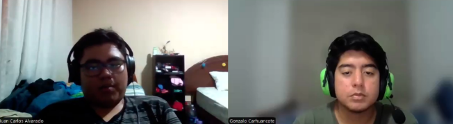
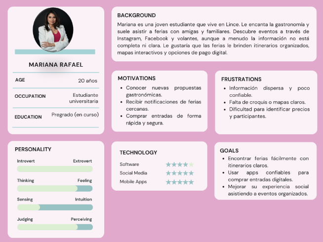
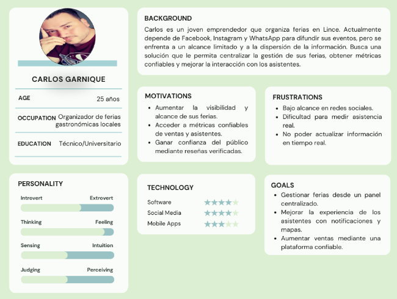
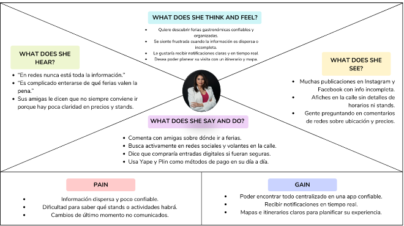
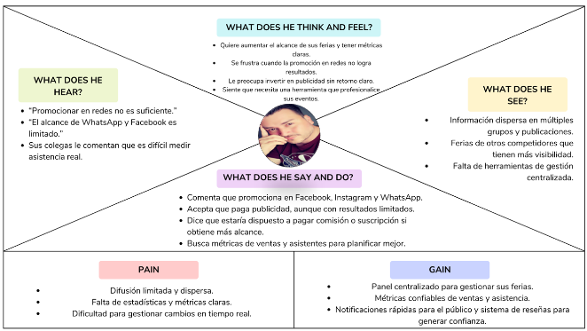

  

<h3 align="center">
Universidad Peruana de Ciencias Aplicadas
</h3>

<h3 align="center">
Ingeniería de Software  
  
Periodo: 202610 
  
1ASI0657 - Fundamentos Arquitectura de Software
  
NRC: 7940  
  
Docente: Mori Yzaguirre, Daniel Enrique  
  
<strong>Informe de TB2</strong>  
  
Startup: Venti  
  
Producto: NextHappen  
  
  
<strong>Integrantes</strong>  
  
Cabanillas Meza, Jose Mateo (u202311458)
  
Nakasone Gomes, Marco Antonio (u202210790)
  
Carhuancote Domminguez, Gonzalo Alonso (u202210720) 
  
 

**2026**
</h3>

# Capítulo I: Introducción
## 1.1 Startup Profile

### 1.1.1 Descripción de la Startup

Venti es una startup limeña que nace con el propósito de transformar la manera en la que los ciudadanos descubren y disfrutan experiencias únicas en la ciudad. A través de nuestro producto NextHappen, buscamos convertirnos en el punto de encuentro digital donde los limeños puedan encontrar de forma sencilla y confiable eventos alternativos, ferias independientes y propuestas culturales con poca difusión.

NextHappen se posiciona como una ventana hacia lo diferente: desde ferias emergentes y eventos indie hasta experiencias artísticas que no suelen aparecer en los canales tradicionales. Además, permite acceder a información clara, compra de entradas y recomendaciones personalizadas según los intereses del usuario.

Con un enfoque cercano, humano y auténtico, NextHappen se plantea como un puente entre creadores, emprendedores y el público, facilitando que más personas descubran y conecten con propuestas únicas que enriquecen la vida cultural de la ciudad.

---

### 1.1.2 Perfiles de integrantes del equipo

| Integrante | Descripción de la carrera | Conocimientos y habilidades a apuntar |
|---|---|---|
| Cabanillas Meza, José Mateo   | Ingeniería de Software | Mi nombre es Mateo Cabanillas y en la actualidad estoy cursando el séptimo ciclo de la carrera de ingeniería de software en la Universidad Peruana de Ciencias Aplicadas, con una mente creativa y una actitud colaborativa. Mi amor por la programación y la resolución de problemas me impulsa a explorar nuevas soluciones y aportar ideas frescas a los proyectos. Como compañero de equipo, soy amable, atento y siempre estoy dispuesto a ayudar. Creo firmemente en la importancia de la comunicación efectiva y la colaboración para lograr resultados excepcionales. |
| Marco Antonio Nakasone Gomes   | Ingeniería de Software | Tengo 21 años y estoy cursando el 8vo ciclo de la carrera de Ingeniería de Software. Considero que soy bueno trabajando de manera grupal y cumplo con todas las tareas a tiempo. Me gusta aportar con ideas buenas y óptimas para poder mejorar el trabajo. |
| Gonzalo Alonso Carhuancote Dominguez   | Ingeniería de Software | Tengo 21 años, estudio la carrera de ingeniería de software en la UPC y trabajo en desarrollo de software. En mis tiempos libres estudio, juego videojuegos y me informo del mundo actual y moderno. Me apasiona la tecnología y manejo lenguajes como C++, Java, Typescript y Python. |

---

## 1.2 Solution Profile

### 1.2.1 Nombre del producto

**NextHappen - Plataforma digital de descubrimiento de eventos alternativos**

---

### 1.2.2 Antecedentes y problemática

En Lima, la oferta de ferias independientes, eventos alternativos y propuestas culturales emergentes ha crecido de forma significativa en los últimos años. Estos espacios no solo impulsan a artistas, colectivos y emprendedores locales, sino que también se han convertido en puntos de encuentro social y cultural para una comunidad que busca experiencias distintas a las tradicionales.

Sin embargo, la forma en que las personas se enteran de estos eventos sigue siendo poco organizada: publicaciones aisladas en redes sociales, historias efímeras, afiches físicos o recomendaciones de boca a boca. Esta fragmentación genera que muchos asistentes potenciales se pierdan de actividades alineadas con sus intereses, mientras que los organizadores enfrentan dificultades para alcanzar a su público objetivo y dar visibilidad a sus propuestas.

A este contexto se suma la falta de herramientas tecnológicas que centralicen la información y permitan tanto a los usuarios como a los organizadores contar con datos actualizados en tiempo real. Problemas como cambios de horarios no comunicados, ubicaciones poco claras o falta de información confiable reducen la experiencia del público y limitan el crecimiento del ecosistema cultural independiente.

En este escenario, surge la necesidad de una solución digital que simplifique el descubrimiento, facilite el acceso a eventos y brinde confianza a todos los involucrados.

- **Who:** Personas que buscan experiencias diferentes en Lima (jóvenes, comunidades creativas, público interesado en lo alternativo, turistas culturales) y organizadores de ferias, eventos indie y propuestas emergentes.

- **What:** El problema central es la dificultad de acceder a información confiable y actualizada sobre eventos alternativos y ferias independientes. Los usuarios desean descubrir nuevas experiencias, conocer horarios, ubicaciones exactas y formas de acceso; mientras que los organizadores necesitan visibilidad, llegar a audiencias específicas y aumentar la asistencia.

- **Where:** La problemática ocurre en Lima Metropolitana, una ciudad con una oferta cultural diversa distribuida en múltiples distritos (Barranco, Miraflores, Centro de Lima, Surco, Pueblo Libre, entre otros), donde suelen surgir eventos en espacios no convencionales como casas culturales, galerías o parques.

- **When:** Estos eventos suelen realizarse principalmente los fines de semana, en temporadas específicas o en fechas puntuales organizadas por colectivos. La necesidad de información en tiempo real es clave justo antes del evento y durante su desarrollo.

- **Why:** Actualmente, la información se encuentra dispersa entre redes sociales, páginas individuales, grupos de mensajería o difusión informal. Esto obliga a los usuarios a invertir tiempo en buscar y validar datos, generando incertidumbre.

- **How:** NextHappen propone resolver este problema mediante una aplicación web que integre un mapa interactivo con filtros personalizados, alertas en tiempo real y un sistema simple para acceder o reservar entradas cuando sea necesario.

- **How much:** El modelo de negocio se basa en una comisión por cada entrada o acceso gestionado dentro de la plataforma y en planes de suscripción para organizadores que deseen mayor visibilidad o herramientas avanzadas.

---

## 1.2.3 Lean UX Process

### 1.2.3.1 Lean UX Problem Statement

#### Problem Statement 1: Usuarios que buscan ferias

Los asistentes a ferias suelen enfrentarse a la falta de información centralizada, actualizada y confiable sobre la ubicación, horarios y costos de los eventos. Esto genera confusión, pérdida de tiempo y, en muchos casos, que no logren asistir a actividades que les interesan.

**¿Cómo podríamos mejorar NextHappen para que los usuarios encuentren ferias gastronómicas de manera sencilla, confiable y en tiempo real, reduciendo la frustración por falta de información y aumentando su asistencia a estos eventos?**

#### Problem Statement 2: Emprendedores y organizadores

Los emprendedores tienen dificultades para dar visibilidad a sus ferias y gestionar de manera eficiente la comunicación con su público. La difusión a través de redes sociales es limitada y poco segmentada, lo que reduce el alcance y las ventas.

**¿Cómo podríamos mejorar NextHappen para que los emprendedores puedan publicar y promocionar sus ferias fácilmente, aumentando su visibilidad y logrando llegar a su público ideal de forma efectiva?**

---

### 1.2.3.2 Lean UX Assumptions

1. Los usuarios prefieren una plataforma unificada donde puedan descubrir y comprar entradas a ferias en un solo lugar.
2. El mapa en tiempo real y las alertas personalizadas aumentarán la asistencia y reducirán la frustración de los usuarios.
3. Los emprendedores estarán dispuestos a pagar una comisión o plan de suscripción a cambio de mayor visibilidad y ventas.
4. Las recomendaciones personalizadas ayudarán a los usuarios a descubrir ferias que de otra manera pasarían desapercibidas.
5. La confianza en la plataforma se fortalecerá con un sistema de reseñas y calificaciones de los usuarios.

---

### 1.2.3.3 Lean UX Hypothesis

#### Hypothesis 1

Creemos que al mostrar ferias cercanas en un mapa interactivo con filtros, los usuarios podrán decidir con mayor rapidez a qué feria asistir.

Sabremos que el mapa cumple su propósito cuando incremente la conversión de “vista de evento → compra de entrada”.

Cuando al menos el 15% de las visitas al detalle de un evento terminen en la compra de una entrada.

#### Hypothesis 2

Creemos que enviar alertas sobre nuevas ferias o cambios de horario reducirá la inasistencia a eventos.

Sabremos que las alertas son efectivas cuando disminuya el número de entradas no utilizadas (no-shows).

Cuando la tasa de no-shows sea al menos un 20% menor en comparación con ferias sin alertas.

#### Hypothesis 3

Creemos que las recomendaciones personalizadas, basadas en los intereses del usuario, aumentarán el descubrimiento de nuevas ferias.

Sabremos que aportarán valor cuando los usuarios hagan clic en las ferias sugeridas.

Cuando al menos el 10% de los clics en la aplicación provengan de tarjetas recomendadas.

#### Hypothesis 4

Creemos que ofrecer un panel de gestión simple a emprendedores facilitará la publicación recurrente de ferias.

Sabremos que la herramienta es útil cuando los emprendedores publiquen más de un evento de forma continua.

Cuando al menos el 30% de ellos repita la publicación en el mes siguiente.

#### Hypothesis 5

Creemos que un sistema de calificaciones y reseñas mejorará la percepción de confianza en la plataforma.

Sabremos que el sistema genera confianza cuando la calificación promedio de los eventos sea elevada y se reduzcan los reclamos.

Cuando la valoración media alcance 4.2/5 o más y los reclamos disminuyan en al menos un 15%.

---

### 1.2.3.4 Lean UX Canvas

| Sección | Contenido |
|---|---|
| Business Problem | La información sobre ferias y eventos independientes está dispersa en redes sociales y medios digitales, dificultando que los usuarios encuentren opciones confiables y relevantes. |
| Solutions | Mapa interactivo, alertas personalizadas, panel de gestión para emprendedores, recomendaciones personalizadas y sistema de reseñas. |
| Business Outcomes | Incrementar usuarios, reducir frustración, aumentar visibilidad de emprendedores y posicionar NextHappen como referente. |
| Users | Personas que buscan experiencias alternativas, asistentes frecuentes a ferias, organizadores y emprendedores culturales. |
| User Outcomes & Benefits | Descubrir ferias fácilmente, comprar entradas rápidas, recibir alertas confiables y mejorar difusión de eventos. |
| Hypotheses | Uso de mapas, alertas, recomendaciones y paneles de gestión para mejorar asistencia y experiencia. |
| What’s the most important thing we need to learn first? | Validar si los usuarios confiarán en NextHappen como fuente principal de información. |
| What’s the least amount of work we need to do? | Crear un prototipo inicial con mapa, búsqueda básica y alertas simples para validar el flujo. |

---

## 1.3 Segmentos objetivo

### Asistentes a ferias y eventos alternativos

Este segmento agrupa a jóvenes limeños en búsqueda de experiencias diferentes, familias que organizan planes de fin de semana y turistas o residentes extranjeros interesados en conocer la ciudad de manera auténtica.

#### Necesidades
- Información centralizada y confiable.
- Compra rápida de entradas.
- Recomendaciones personalizadas.
- Detalles claros de ubicación y horarios.

#### Características
- Uso frecuente de smartphones y redes sociales.
- Interés en actividades culturales y gastronómicas.
- Alta disposición a compartir experiencias.

---

### Organizadores, emprendedores y colectivos culturales

Este segmento incluye a los responsables de crear y gestionar ferias, eventos independientes y propuestas culturales emergentes.

#### Necesidades
- Mayor visibilidad y alcance.
- Herramientas para gestionar eventos.
- Comunicación directa con asistentes.
- Acceso a métricas de desempeño.

#### Características
- Interés en soluciones tecnológicas prácticas.
- Participación activa en el ecosistema cultural.
- Necesidad de optimizar recursos y maximizar asistencia.

# Capítulo II: Requirements & Analysis

---

# 2.1 Competidores

## Competitive Analysis Landscape

### ¿Por qué llevar a cabo este análisis?

¿En qué nos diferenciamos frente a otros competidores ya consolidados?

---

| | Nexthappen | Joinnus | Atrápalo.pe | Facebook Events |
|---|---|---|---|---|
| **Perfil Overview** | Plataforma local de organización y venta de eventos con poca visualización. | Plataforma peruana que gestiona entradas a múltiples eventos culturales, deportivos y gastronómicos. | Marketplace digital con foco en experiencias y ocio, incluyendo algunos eventos culturales. | Red social con función integrada de creación y difusión de eventos abiertos o privados. |
| **Ventaja competitiva** | Usuarios buscan eventos pequeños y poco difundidos. | Confiabilidad en pagos y notoriedad en Perú. | Promociones atractivas y diversidad de experiencias. | Difusión masiva gracias a la red social. |
| **Mercado objetivo** | Eventos pequeños y alternativos. | Público joven-adulto interesado en eventos culturales y entretenimiento. | Usuarios interesados en ocio, viajes y gastronomía. | Usuarios de Facebook de todas las edades. |
| **Estrategias de marketing** | Publicidad online dentro de la misma página. | Campañas en redes sociales y colaboraciones. | Publicidad online, ofertas y descuentos. | Viralización orgánica e invitaciones directas. |
| **Productos & Servicios** | Venta y gestión de entradas y difusión del evento. | Venta de entradas y marketing digital. | Venta de experiencias y eventos. | Difusión de eventos gratuitos o pagos. |
| **Precios & Costos** | Comisión por entrada vendida. | Comisión por entrada vendida. | Comisión variable sobre reservas. | Gratuito para publicación. |
| **Canales de distribución** | App web. | Web y app móvil. | Web y app móvil. | Facebook App y Web. |

---

## Análisis SWOT

| Categoría | NextHappen | Joinnus | Atrápalo.pe | Facebook Events |
|---|---|---|---|---|
| **Fortalezas** | Usuarios buscan eventos poco difundidos. | Marca reconocida y segura. | Diversidad de experiencias. | Alcance masivo. |
| **Debilidades** | Poca gente conoce la página. | Limitado al ticketing. | Baja penetración en Lima cultural. | Información poco confiable. |
| **Oportunidades** | Asociarse con organizaciones culturales. | Expandirse al sector gastronómico. | Asociarse con organizadores. | Integrar más funciones de compra. |
| **Amenazas** | Baja confianza inicial de usuarios. | Nuevos competidores especializados. | Baja frecuencia de uso cultural. | Saturación de información. |

---

# 2.2 Entrevistas

## Diseño de entrevistas

### Preguntas Generales

- ¿Cuál es su nombre, edad y distrito de residencia?
- ¿A qué se dedica actualmente?

---

### Preguntas para Usuarios (asistentes a ferias)

- ¿Cómo te enteras de las ferias actualmente?
- ¿Qué dificultades encuentras al buscar información sobre ferias?
- ¿Qué información consideras indispensable antes de decidir asistir?
- ¿Te interesaría recibir notificaciones en tiempo real sobre ferias cerca de ti?
- ¿Comprarías entradas de forma digital? ¿Qué método de pago prefieres?

---

### Preguntas para Emprendedores/Organizadores

- ¿Cómo promocionas tus ferias actualmente?
- ¿Qué limitaciones encuentran en redes sociales u otros canales?
- ¿Qué métricas te gustaría conocer?
- ¿Estarías dispuesto a pagar comisión o suscripción?
- ¿Qué funcionalidades valoras más en una plataforma digital?

---

## Entrevista 1 - Usuario

- **Nombre:** Dario Salcador
- **Edad:** 23
- **Distrito:** San Miguel
- **Duración:** 02:35
- **Link:** Segmento 1 - Fund. Arq. Entrevista.mp4

### Resumen
Buscan un lugar confiable y centralizado donde descubrir eventos con información clara, recomendaciones y opciones rápidas de compra.

---

## Entrevista 2 - Organizador

- **Nombre:** Juan Carlos Alvarado
- **Edad:** 26
- **Distrito:** Callao
- **Duración:** 02:16
- **Link:** Segmento 2 - Fund. Arq. Entrevista.mp4

### Resumen
Necesitan una plataforma que aumente su visibilidad sin depender de redes sociales, con métricas claras y herramientas simples de gestión.

---

## Análisis de Entrevistas

### Segmento: Organizadores / Emprendedores

#### Características objetivas

- El 80% promociona sus eventos principalmente en redes sociales.
- El 70% utiliza más de un canal de difusión.
- El 60% no cuenta con herramientas formales de gestión.
- El 75% está dispuesto a pagar por mayor visibilidad.

#### Características subjetivas

- El 85% percibe bajo alcance orgánico en redes sociales.
- El 70% tiene dificultades para llegar a su público objetivo.
- El 80% considera importante contar con métricas claras.
- El 65% prefiere herramientas simples y prácticas.

#### Análisis

Los organizadores dependen de las redes sociales, pero no están satisfechos con sus resultados. Buscan mayor visibilidad, métricas claras y herramientas simples de gestión.

---

### Segmento: Asistentes a ferias y eventos

#### Características objetivas

- El 85% descubre eventos mediante redes sociales.
- El 65% se guía por recomendaciones de terceros.
- El 75% usa smartphones para buscar actividades.
- El 80% está dispuesto a comprar entradas digitales.

#### Características subjetivas

- El 80% percibe información incompleta o desactualizada.
- El 75% valora información clara.
- El 70% desea recomendaciones personalizadas.
- El 85% muestra interés en notificaciones cercanas.

#### Análisis

Los usuarios buscan experiencias, pero enfrentan dificultades por la falta de información centralizada. Valoran la facilidad, la confianza y la personalización.

---

# 2.3 Needfinding

---

## 2.3.1 User Personas

---

## 2.3.2 User Task Matrix

### Segmento 1 - Usuario

| Tarea | Frecuencia | Importancia |
|---|---|---|
| Buscar información sobre ferias | Often | High |
| Ubicar ferias en un mapa | Often | High |
| Comprar entradas online | Occasionally | High |
| Recibir notificaciones en tiempo real | Often | High |
| Consultar reseñas de asistentes | Occasionally | Medium |

---

### Segmento 2 - Organizador

| Tarea | Frecuencia | Importancia |
|---|---|---|
| Promocionar ferias en la plataforma | Often | High |
| Actualizar información en tiempo real | Often | High |
| Consultar métricas | Occasionally | High |
| Gestionar ferias desde un panel | Occasionally | High |
| Recibir feedback de asistentes | Occasionally | Medium |

---

## 2.3.3 Empathy Maps

---

## 2.3.4 As-is Scenario Mapping

### Segmento 1 - Dario Salvador

| Phases | Buscar Información | Planificar la visita | Asistir a la feria | Compartir experiencia |
|---|---|---|---|---|
| **Doing** | Revisa Instagram y Facebook. | Anota horarios y ubicaciones. | Sigue direcciones desde redes. | Comenta experiencia con amigos. |
| **Thinking** | ¿Dónde encuentro información confiable? | ¿Dónde está exactamente el evento? | ¿Qué horarios tienen las actividades? | ¿Valdrá la pena recomendarla? |
| **Feeling** | Frustración por información dispersa. | Ansiedad y confusión. | Emoción por asistir. | Satisfacción o molestia según experiencia. |

---

### Segmento 2 - Juan Carlos Alvarado

| Phases | Buscar Información | Planificar la visita | Asistir a la feria | Compartir experiencia |
|---|---|---|---|---|
| **Doing** | Publica en Facebook e Instagram. | Recibe mensajes manualmente. | Estima asistentes por likes. | Publica cambios rápidamente. |
| **Thinking** | ¿Cómo llegar a más personas? | ¿Cuántas entradas se vendieron? | ¿Vale la pena invertir más? | ¿Cómo evitar frustración? |
| **Feeling** | Preocupación por bajo alcance. | Agobio por gestión manual. | Inseguridad por falta de métricas. | Estrés por cambios de último momento. |

